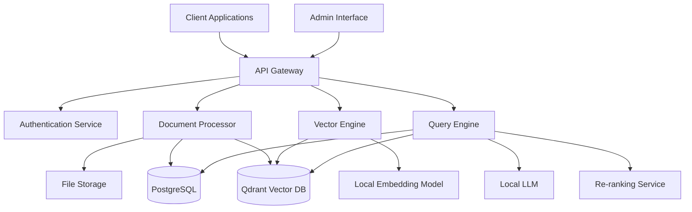

# System Architecture

## Overview

The Open Source RAG System follows a microservices architecture designed for scalability, maintainability, and local deployment. The system ensures that all responses are grounded in source documents with full traceability.

## High-Level Architecture



## Core Components

### 1. API Gateway
**Technology**: FastAPI with Pydantic
**Responsibility**: Request routing, authentication, rate limiting, API documentation

**Key Features**:
- RESTful API endpoints
- OpenAPI/Swagger documentation
- JWT-based authentication
- Request validation and sanitization
- CORS handling
- Rate limiting and throttling

### 2. Document Processor
**Technology**: Python with specialized libraries
**Responsibility**: Document ingestion, parsing, and preprocessing

**Supported Formats**:
- **PDF**: PyPDF2, pdfplumber, pymupdf
- **Word**: python-docx, python-docx2txt
- **Excel**: openpyxl, pandas
- **XML**: lxml, BeautifulSoup
- **Text**: Built-in text processing

**Processing Pipeline**:
1. **File Upload**: Secure file handling with validation
2. **Format Detection**: Automatic MIME type detection
3. **Text Extraction**: Format-specific extraction with metadata
4. **Chunking**: Intelligent text segmentation
5. **Preprocessing**: Cleaning, normalization, entity extraction
6. **Metadata Generation**: Document properties, creation date, author
7. **Storage**: File system storage with database records

### 3. Vector Engine
**Technology**: Qdrant vector database with sentence-transformers
**Responsibility**: Embedding generation and similarity search

**Components**:
- **Embedding Model**: sentence-transformers/all-mpnet-base-v2
- **Vector Database**: Qdrant with HNSW indexing
- **Batch Processing**: Efficient bulk embedding generation
- **Search Interface**: High-performance similarity search

**Features**:
- Semantic search with configurable similarity thresholds
- Batch embedding processing
- Index optimization and maintenance
- Multi-modal embedding support (future)

### 4. Query Engine
**Technology**: Custom Python service with LangChain integration
**Responsibility**: Query processing, retrieval, and response generation

**Query Processing Flow**:
1. **Query Analysis**: Intent detection and query expansion
2. **Vector Retrieval**: Semantic search in vector database
3. **Re-ranking**: Advanced relevance scoring
4. **Context Assembly**: Gather relevant document chunks
5. **Response Generation**: LLM-based answer synthesis
6. **Source Attribution**: Document ID and chunk mapping
7. **Confidence Scoring**: Response reliability assessment

### 5. Database Layer

#### PostgreSQL (Metadata Store)
**Schema Design**:
```sql
-- Documents table
CREATE TABLE documents (
    id UUID PRIMARY KEY DEFAULT gen_random_uuid(),
    filename VARCHAR(255) NOT NULL,
    file_path TEXT NOT NULL,
    mime_type VARCHAR(100),
    file_size BIGINT,
    upload_timestamp TIMESTAMP DEFAULT CURRENT_TIMESTAMP,
    processed_timestamp TIMESTAMP,
    status VARCHAR(50) DEFAULT 'pending',
    metadata JSONB,
    checksum VARCHAR(64)
);

-- Document chunks table
CREATE TABLE document_chunks (
    id UUID PRIMARY KEY DEFAULT gen_random_uuid(),
    document_id UUID REFERENCES documents(id) ON DELETE CASCADE,
    chunk_index INTEGER NOT NULL,
    content TEXT NOT NULL,
    chunk_metadata JSONB,
    vector_id VARCHAR(255), -- Reference to Qdrant
    page_number INTEGER,
    start_char INTEGER,
    end_char INTEGER
);

-- Query logs table
CREATE TABLE query_logs (
    id UUID PRIMARY KEY DEFAULT gen_random_uuid(),
    query_text TEXT NOT NULL,
    response_text TEXT,
    source_documents JSONB,
    confidence_score FLOAT,
    timestamp TIMESTAMP DEFAULT CURRENT_TIMESTAMP,
    user_id VARCHAR(255),
    processing_time_ms INTEGER
);
```

#### Qdrant Vector Database
**Configuration**:
- Collection per document type (optional)
- 768-dimensional vectors (sentence-transformers)
- HNSW index with optimized parameters
- Payload includes document_id, chunk_id, metadata

### 6. Local LLM Integration
**Primary Options**:
- **Ollama**: Easy local deployment of various models
- **vLLM**: High-performance inference server
- **Text Generation Inference**: Hugging Face's solution

**Recommended Models**:
- **Llama 3.1 8B**: Good balance of performance and resource usage
- **Mistral 7B**: Efficient and accurate
- **CodeLlama**: For code-related documents

## Data Flow

### Document Ingestion Flow
```
1. Client uploads document → API Gateway
2. Gateway validates and stores file → File Storage
3. Document Processor extracts text and metadata
4. Text chunked and preprocessed
5. Chunks embedded using local model
6. Vectors stored in Qdrant
7. Metadata stored in PostgreSQL
8. Status updated to 'processed'
```

### Query Processing Flow
```
1. Client sends query → API Gateway
2. Query Engine receives validated query
3. Query embedded using same model
4. Vector similarity search in Qdrant
5. Retrieved chunks re-ranked
6. Context assembled with source attribution
7. LLM generates response with sources
8. Response validated and returned
9. Query logged for analytics
```

## Source Attribution System

### Traceability Requirements
Every response must include:
- Document ID and filename
- Page number (for PDFs)
- Chunk/section reference
- Confidence score
- Character-level positioning (when possible)

### Attribution Data Structure
```json
{
  "response": "The main topic is artificial intelligence...",
  "sources": [
    {
      "document_id": "123e4567-e89b-12d3-a456-426614174000",
      "filename": "ai_research_paper.pdf",
      "page_number": 3,
      "chunk_id": "chunk_123",
      "relevance_score": 0.87,
      "text_snippet": "Artificial intelligence represents...",
      "start_char": 245,
      "end_char": 389
    }
  ],
  "confidence": 0.92
}
```

## Scalability Considerations

### Horizontal Scaling
- **API Gateway**: Multiple instances behind load balancer
- **Document Processor**: Queue-based processing with workers
- **Vector Engine**: Qdrant clustering
- **Database**: PostgreSQL read replicas

### Performance Optimization
- **Caching**: Redis for frequent queries
- **Batch Processing**: Bulk operations for document ingestion
- **Index Optimization**: Regular vector index maintenance
- **Connection Pooling**: Database connection management

### Resource Requirements

#### Minimum Configuration
- **CPU**: 8 cores
- **RAM**: 32 GB
- **Storage**: 500 GB SSD
- **GPU**: Optional, recommended for faster embedding

#### Recommended Configuration
- **CPU**: 16 cores
- **RAM**: 64 GB
- **Storage**: 2 TB NVMe SSD
- **GPU**: NVIDIA RTX 4090 or equivalent

## Monitoring and Observability

### Metrics Collection
- **Application Metrics**: Query latency, throughput, error rates
- **System Metrics**: CPU, memory, disk usage
- **Business Metrics**: Document processing rates, user activity

### Logging Strategy
- **Structured Logging**: JSON format with correlation IDs
- **Log Levels**: DEBUG, INFO, WARN, ERROR with appropriate routing
- **Audit Logging**: Document access and query tracking

### Health Checks
- **Service Health**: Endpoint availability and response times
- **Database Health**: Connection status and query performance
- **Model Health**: Embedding and LLM service status
- **Storage Health**: File system and database storage monitoring

## Security Architecture

### Authentication & Authorization
- **JWT Tokens**: Stateless authentication
- **RBAC**: Role-based access control
- **API Keys**: Service-to-service authentication

### Data Security
- **Encryption at Rest**: Database and file system encryption
- **Encryption in Transit**: TLS 1.3 for all communications
- **Input Validation**: Comprehensive request sanitization
- **Rate Limiting**: DDoS protection and abuse prevention

### Privacy Protection
- **Data Isolation**: User data segregation
- **Audit Trails**: Complete access logging
- **Data Retention**: Configurable retention policies
- **GDPR Compliance**: Right to deletion and data portability
