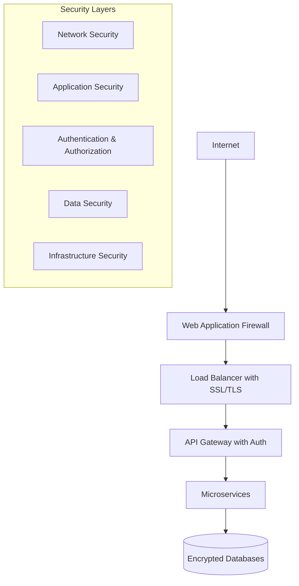

# Security Guide

## Overview

The Open Source RAG System implements comprehensive security measures to protect sensitive data, ensure secure communications, and maintain system integrity. This guide covers all security aspects from deployment to operation.

## Security Architecture

### Defense in Depth Strategy



### Core Security Principles

1. **Zero Trust Architecture**: Never trust, always verify
2. **Principle of Least Privilege**: Minimal necessary access
3. **Data Minimization**: Collect and store only necessary data
4. **Encryption Everywhere**: Data in transit and at rest
5. **Continuous Monitoring**: Real-time threat detection

## Authentication & Authorization

### JWT Token-Based Authentication

#### Token Structure
```json
{
  "header": {
    "alg": "HS256",
    "typ": "JWT"
  },
  "payload": {
    "user_id": "123e4567-e89b-12d3-a456-426614174000",
    "username": "user@example.com",
    "roles": ["user", "admin"],
    "exp": 1725654400,
    "iat": 1725650800,
    "iss": "rag-system",
    "aud": "rag-api"
  },
  "signature": "..."
}
```

#### Implementation
```python
# app/core/security.py
import os
import jwt
from datetime import datetime, timedelta
from typing import Dict, Optional, List
from passlib.context import CryptContext
from fastapi import HTTPException, status

class SecurityManager:
    def __init__(self):
        self.secret_key = os.getenv("JWT_SECRET_KEY")
        self.algorithm = "HS256"
        self.access_token_expire_minutes = 60
        self.pwd_context = CryptContext(schemes=["bcrypt"], deprecated="auto")
        
        if not self.secret_key:
            raise ValueError("JWT_SECRET_KEY environment variable is required")
    
    def create_access_token(self, data: Dict) -> str:
        """Create a new JWT access token."""
        to_encode = data.copy()
        expire = datetime.utcnow() + timedelta(minutes=self.access_token_expire_minutes)
        
        to_encode.update({
            "exp": expire,
            "iat": datetime.utcnow(),
            "iss": "rag-system",
            "aud": "rag-api"
        })
        
        return jwt.encode(to_encode, self.secret_key, algorithm=self.algorithm)
    
    def verify_token(self, token: str) -> Dict:
        """Verify and decode JWT token."""
        try:
            payload = jwt.decode(
                token, 
                self.secret_key, 
                algorithms=[self.algorithm],
                audience="rag-api",
                issuer="rag-system"
            )
            
            # Check token expiration
            if datetime.utcnow() > datetime.fromtimestamp(payload.get("exp", 0)):
                raise HTTPException(
                    status_code=status.HTTP_401_UNAUTHORIZED,
                    detail="Token has expired"
                )
            
            return payload
            
        except jwt.ExpiredSignatureError:
            raise HTTPException(
                status_code=status.HTTP_401_UNAUTHORIZED,
                detail="Token has expired"
            )
        except jwt.InvalidTokenError:
            raise HTTPException(
                status_code=status.HTTP_401_UNAUTHORIZED,
                detail="Invalid token"
            )
    
    def hash_password(self, password: str) -> str:
        """Hash a password using bcrypt."""
        return self.pwd_context.hash(password)
    
    def verify_password(self, plain_password: str, hashed_password: str) -> bool:
        """Verify a password against its hash."""
        return self.pwd_context.verify(plain_password, hashed_password)
```

### Role-Based Access Control (RBAC)

#### Permission System
```python
# app/core/permissions.py
from enum import Enum
from typing import List, Set
from functools import wraps
from fastapi import HTTPException, status

class Permission(Enum):
    # Document permissions
    DOCUMENT_READ = "document:read"
    DOCUMENT_WRITE = "document:write"
    DOCUMENT_DELETE = "document:delete"
    DOCUMENT_ADMIN = "document:admin"
    
    # Query permissions
    QUERY_EXECUTE = "query:execute"
    QUERY_ADVANCED = "query:advanced"
    
    # System permissions
    SYSTEM_ADMIN = "system:admin"
    SYSTEM_MONITOR = "system:monitor"
    ANALYTICS_VIEW = "analytics:view"

class Role(Enum):
    USER = "user"
    MODERATOR = "moderator"
    ADMIN = "admin"
    SUPER_ADMIN = "super_admin"

# Role-Permission mapping
ROLE_PERMISSIONS = {
    Role.USER: {
        Permission.DOCUMENT_READ,
        Permission.DOCUMENT_WRITE,
        Permission.QUERY_EXECUTE
    },
    Role.MODERATOR: {
        Permission.DOCUMENT_READ,
        Permission.DOCUMENT_WRITE,
        Permission.DOCUMENT_DELETE,
        Permission.QUERY_EXECUTE,
        Permission.QUERY_ADVANCED,
        Permission.ANALYTICS_VIEW
    },
    Role.ADMIN: {
        Permission.DOCUMENT_READ,
        Permission.DOCUMENT_WRITE,
        Permission.DOCUMENT_DELETE,
        Permission.DOCUMENT_ADMIN,
        Permission.QUERY_EXECUTE,
        Permission.QUERY_ADVANCED,
        Permission.ANALYTICS_VIEW,
        Permission.SYSTEM_MONITOR
    },
    Role.SUPER_ADMIN: set(Permission)  # All permissions
}

def require_permission(permission: Permission):
    """Decorator to require specific permission for endpoint access."""
    def decorator(func):
        @wraps(func)
        async def wrapper(*args, **kwargs):
            # Extract user from kwargs (injected by dependency)
            user = kwargs.get('user')
            if not user:
                raise HTTPException(
                    status_code=status.HTTP_401_UNAUTHORIZED,
                    detail="Authentication required"
                )
            
            user_permissions = get_user_permissions(user)
            if permission not in user_permissions:
                raise HTTPException(
                    status_code=status.HTTP_403_FORBIDDEN,
                    detail=f"Permission required: {permission.value}"
                )
            
            return await func(*args, **kwargs)
        return wrapper
    return decorator

def get_user_permissions(user: Dict) -> Set[Permission]:
    """Get all permissions for a user based on their roles."""
    user_permissions = set()
    user_roles = user.get('roles', [])
    
    for role_name in user_roles:
        try:
            role = Role(role_name)
            user_permissions.update(ROLE_PERMISSIONS.get(role, set()))
        except ValueError:
            continue  # Invalid role, skip
    
    return user_permissions
```

## Input Validation & Sanitization

### Request Validation
```python
# app/core/validation.py
import re
import bleach
from typing import Any, Dict, List, Optional
from pydantic import BaseModel, validator, Field
from fastapi import HTTPException, status

class QueryRequest(BaseModel):
    query: str = Field(..., min_length=1, max_length=1000)
    top_k: int = Field(default=5, ge=1, le=100)
    filters: Optional[Dict[str, Any]] = None
    
    @validator('query')
    def sanitize_query(cls, v):
        # Remove potentially dangerous characters and HTML
        sanitized = bleach.clean(v, tags=[], attributes={}, strip=True)
        
        # Check for SQL injection patterns
        sql_patterns = [
            r'\b(union|select|insert|update|delete|drop|create|alter)\b',
            r'[;\'"\\]',
            r'--',
            r'/\*|\*/'
        ]
        
        for pattern in sql_patterns:
            if re.search(pattern, sanitized.lower()):
                raise ValueError("Query contains potentially harmful content")
        
        return sanitized
    
    @validator('filters')
    def validate_filters(cls, v):
        if v is None:
            return v
        
        # Limit filter complexity
        if len(v) > 10:
            raise ValueError("Too many filter conditions")
        
        # Validate filter values
        for key, value in v.items():
            if isinstance(value, str):
                if len(value) > 100:
                    raise ValueError(f"Filter value too long: {key}")
            elif isinstance(value, list):
                if len(value) > 20:
                    raise ValueError(f"Too many filter values: {key}")
        
        return v

# File upload validation
class FileValidator:
    ALLOWED_EXTENSIONS = {'.pdf', '.docx', '.xlsx', '.xml', '.txt', '.md', '.csv'}
    MAX_FILE_SIZE = 100 * 1024 * 1024  # 100MB
    
    DANGEROUS_PATTERNS = [
        b'<script',
        b'javascript:',
        b'<?php',
        b'<%',
        b'\x00',  # Null bytes
    ]
    
    @classmethod
    async def validate_file(cls, file) -> bool:
        """Validate uploaded file for security issues."""
        # Check file size
        file_content = await file.read()
        await file.seek(0)  # Reset file pointer
        
        if len(file_content) > cls.MAX_FILE_SIZE:
            raise HTTPException(
                status_code=status.HTTP_413_REQUEST_ENTITY_TOO_LARGE,
                detail="File too large"
            )
        
        # Check file extension
        file_ext = Path(file.filename).suffix.lower()
        if file_ext not in cls.ALLOWED_EXTENSIONS:
            raise HTTPException(
                status_code=status.HTTP_400_BAD_REQUEST,
                detail=f"File type not allowed: {file_ext}"
            )
        
        # Check for dangerous content patterns
        for pattern in cls.DANGEROUS_PATTERNS:
            if pattern in file_content:
                raise HTTPException(
                    status_code=status.HTTP_400_BAD_REQUEST,
                    detail="File contains potentially harmful content"
                )
        
        # Additional MIME type validation
        import magic
        detected_mime = magic.from_buffer(file_content, mime=True)
        
        expected_mimes = {
            '.pdf': 'application/pdf',
            '.docx': 'application/vnd.openxmlformats-officedocument.wordprocessingml.document',
            '.xlsx': 'application/vnd.openxmlformats-officedocument.spreadsheetml.sheet',
            '.xml': ['application/xml', 'text/xml'],
            '.txt': 'text/plain',
            '.md': 'text/plain',
            '.csv': 'text/csv'
        }
        
        expected = expected_mimes.get(file_ext)
        if isinstance(expected, list):
            if detected_mime not in expected:
                raise HTTPException(
                    status_code=status.HTTP_400_BAD_REQUEST,
                    detail="File content doesn't match extension"
                )
        elif expected and detected_mime != expected:
            raise HTTPException(
                status_code=status.HTTP_400_BAD_REQUEST,
                detail="File content doesn't match extension"
            )
        
        return True
```

## Data Encryption

### Encryption at Rest

#### Database Encryption
```sql
-- PostgreSQL encryption setup
-- Enable encryption extension
CREATE EXTENSION IF NOT EXISTS pgcrypto;

-- Create encrypted tables
CREATE TABLE encrypted_documents (
    id UUID PRIMARY KEY DEFAULT gen_random_uuid(),
    filename_encrypted BYTEA,  -- Encrypted filename
    content_encrypted BYTEA,   -- Encrypted content
    metadata_encrypted BYTEA,  -- Encrypted metadata
    encryption_key_id VARCHAR(255),
    created_at TIMESTAMP DEFAULT CURRENT_TIMESTAMP
);

-- Encryption functions
CREATE OR REPLACE FUNCTION encrypt_data(data TEXT, key_id VARCHAR)
RETURNS BYTEA AS $$
BEGIN
    -- Use AES-256-GCM encryption
    RETURN pgp_sym_encrypt(data, key_id, 'compress-algo=1, cipher-algo=aes256');
END;
$$ LANGUAGE plpgsql;

CREATE OR REPLACE FUNCTION decrypt_data(encrypted_data BYTEA, key_id VARCHAR)
RETURNS TEXT AS $$
BEGIN
    RETURN pgp_sym_decrypt(encrypted_data, key_id);
END;
$$ LANGUAGE plpgsql;
```

#### File System Encryption
```python
# app/core/encryption.py
import os
import base64
from cryptography.fernet import Fernet
from cryptography.hazmat.primitives import hashes
from cryptography.hazmat.primitives.kdf.pbkdf2 import PBKDF2HMAC

class EncryptionManager:
    def __init__(self):
        self.master_key = os.getenv("ENCRYPTION_MASTER_KEY")
        if not self.master_key:
            raise ValueError("ENCRYPTION_MASTER_KEY is required")
        
        # Derive encryption key from master key
        kdf = PBKDF2HMAC(
            algorithm=hashes.SHA256(),
            length=32,
            salt=b'rag_system_salt',  # Use unique salt per deployment
            iterations=100000,
        )
        key = base64.urlsafe_b64encode(kdf.derive(self.master_key.encode()))
        self.fernet = Fernet(key)
    
    def encrypt_file(self, file_path: str) -> str:
        """Encrypt a file and return the encrypted file path."""
        with open(file_path, 'rb') as f:
            file_data = f.read()
        
        encrypted_data = self.fernet.encrypt(file_data)
        encrypted_path = f"{file_path}.encrypted"
        
        with open(encrypted_path, 'wb') as f:
            f.write(encrypted_data)
        
        # Remove original file
        os.remove(file_path)
        return encrypted_path
    
    def decrypt_file(self, encrypted_file_path: str) -> bytes:
        """Decrypt a file and return its contents."""
        with open(encrypted_file_path, 'rb') as f:
            encrypted_data = f.read()
        
        return self.fernet.decrypt(encrypted_data)
    
    def encrypt_text(self, text: str) -> str:
        """Encrypt text data."""
        encrypted_bytes = self.fernet.encrypt(text.encode())
        return base64.urlsafe_b64encode(encrypted_bytes).decode()
    
    def decrypt_text(self, encrypted_text: str) -> str:
        """Decrypt text data."""
        encrypted_bytes = base64.urlsafe_b64decode(encrypted_text.encode())
        decrypted_bytes = self.fernet.decrypt(encrypted_bytes)
        return decrypted_bytes.decode()
```

### Encryption in Transit

#### TLS Configuration
```yaml
# nginx/ssl.conf
server {
    listen 443 ssl http2;
    listen [::]:443 ssl http2;
    server_name api.yourragdomain.com;

    # SSL Configuration
    ssl_certificate /etc/nginx/ssl/fullchain.pem;
    ssl_certificate_key /etc/nginx/ssl/privkey.pem;
    
    # Modern SSL configuration
    ssl_protocols TLSv1.3 TLSv1.2;
    ssl_ciphers ECDHE-ECDSA-AES128-GCM-SHA256:ECDHE-RSA-AES128-GCM-SHA256:ECDHE-ECDSA-AES256-GCM-SHA384:ECDHE-RSA-AES256-GCM-SHA384;
    ssl_prefer_server_ciphers off;
    
    # HSTS
    add_header Strict-Transport-Security "max-age=63072000" always;
    
    # Security headers
    add_header X-Frame-Options DENY always;
    add_header X-Content-Type-Options nosniff always;
    add_header X-XSS-Protection "1; mode=block" always;
    add_header Referrer-Policy "strict-origin-when-cross-origin" always;
    add_header Content-Security-Policy "default-src 'self'; script-src 'self'; style-src 'self' 'unsafe-inline'; img-src 'self' data:; font-src 'self'; connect-src 'self'; frame-ancestors 'none';" always;
    
    # Certificate transparency
    ssl_stapling on;
    ssl_stapling_verify on;
    
    location / {
        proxy_pass http://api-gateway:8000;
        proxy_set_header Host $host;
        proxy_set_header X-Real-IP $remote_addr;
        proxy_set_header X-Forwarded-For $proxy_add_x_forwarded_for;
        proxy_set_header X-Forwarded-Proto $scheme;
        
        # Timeouts
        proxy_read_timeout 60s;
        proxy_send_timeout 60s;
        proxy_connect_timeout 60s;
    }
}

# Redirect HTTP to HTTPS
server {
    listen 80;
    listen [::]:80;
    server_name api.yourragdomain.com;
    return 301 https://$server_name$request_uri;
}
```

## Network Security

### Firewall Rules
```bash
#!/bin/bash
# firewall-setup.sh

# Reset iptables
iptables -F
iptables -X
iptables -t nat -F
iptables -t nat -X

# Default policies
iptables -P INPUT DROP
iptables -P FORWARD DROP
iptables -P OUTPUT ACCEPT

# Allow loopback
iptables -A INPUT -i lo -j ACCEPT

# Allow established connections
iptables -A INPUT -m state --state ESTABLISHED,RELATED -j ACCEPT

# Allow SSH (change port as needed)
iptables -A INPUT -p tcp --dport 22 -j ACCEPT

# Allow HTTP/HTTPS
iptables -A INPUT -p tcp --dport 80 -j ACCEPT
iptables -A INPUT -p tcp --dport 443 -j ACCEPT

# Allow specific service ports (adjust as needed)
iptables -A INPUT -p tcp --dport 8000 -s 10.0.0.0/8 -j ACCEPT  # API Gateway (internal only)
iptables -A INPUT -p tcp --dport 5432 -s 10.0.0.0/8 -j ACCEPT  # PostgreSQL (internal only)
iptables -A INPUT -p tcp --dport 6333 -s 10.0.0.0/8 -j ACCEPT  # Qdrant (internal only)
iptables -A INPUT -p tcp --dport 6379 -s 10.0.0.0/8 -j ACCEPT  # Redis (internal only)

# Rate limiting for HTTP/HTTPS
iptables -A INPUT -p tcp --dport 80 -m limit --limit 25/minute --limit-burst 100 -j ACCEPT
iptables -A INPUT -p tcp --dport 443 -m limit --limit 25/minute --limit-burst 100 -j ACCEPT

# Drop all other traffic
iptables -A INPUT -j DROP

# Save rules
iptables-save > /etc/iptables/rules.v4
```

### Network Segmentation
```yaml
# docker-compose.network.yml - Network isolation
version: '3.8'

networks:
  frontend:
    driver: bridge
    ipam:
      config:
        - subnet: 172.20.1.0/24
  
  backend:
    driver: bridge
    ipam:
      config:
        - subnet: 172.20.2.0/24
  
  database:
    driver: bridge
    ipam:
      config:
        - subnet: 172.20.3.0/24
    internal: true  # No external access

services:
  nginx:
    networks:
      - frontend
  
  api-gateway:
    networks:
      - frontend
      - backend
  
  document-processor:
    networks:
      - backend
      - database
  
  postgres:
    networks:
      - database
  
  qdrant:
    networks:
      - database
```

## Secrets Management

### Kubernetes Secrets
```yaml
# secrets.yaml
apiVersion: v1
kind: Secret
metadata:
  name: rag-secrets
  namespace: rag-system
type: Opaque
data:
  postgres-password: <base64-encoded-password>
  jwt-secret: <base64-encoded-jwt-secret>
  encryption-key: <base64-encoded-encryption-key>
  redis-password: <base64-encoded-redis-password>

---
apiVersion: v1
kind: Secret
metadata:
  name: ssl-certificates
  namespace: rag-system
type: kubernetes.io/tls
data:
  tls.crt: <base64-encoded-certificate>
  tls.key: <base64-encoded-private-key>
```

### HashiCorp Vault Integration
```python
# app/core/vault.py
import hvac
import os
from typing import Dict, Optional

class VaultClient:
    def __init__(self):
        self.client = hvac.Client(
            url=os.getenv('VAULT_URL', 'http://localhost:8200'),
            token=os.getenv('VAULT_TOKEN')
        )
        
        if not self.client.is_authenticated():
            raise ValueError("Vault authentication failed")
    
    def get_secret(self, path: str) -> Optional[Dict]:
        """Retrieve secret from Vault."""
        try:
            response = self.client.secrets.kv.v2.read_secret_version(path=path)
            return response['data']['data']
        except Exception as e:
            logger.error(f"Failed to retrieve secret from {path}: {e}")
            return None
    
    def store_secret(self, path: str, secret: Dict) -> bool:
        """Store secret in Vault."""
        try:
            self.client.secrets.kv.v2.create_or_update_secret(
                path=path,
                secret=secret
            )
            return True
        except Exception as e:
            logger.error(f"Failed to store secret at {path}: {e}")
            return False
```

## Security Monitoring

### Audit Logging
```python
# app/core/audit.py
import logging
import json
from datetime import datetime
from typing import Dict, Any, Optional
from sqlalchemy.ext.asyncio import AsyncSession

class AuditLogger:
    def __init__(self):
        self.logger = logging.getLogger("audit")
        handler = logging.FileHandler("/app/logs/audit.log")
        formatter = logging.Formatter(
            '%(asctime)s - %(name)s - %(levelname)s - %(message)s'
        )
        handler.setFormatter(formatter)
        self.logger.addHandler(handler)
        self.logger.setLevel(logging.INFO)
    
    async def log_event(
        self,
        event_type: str,
        user_id: Optional[str],
        resource_id: Optional[str],
        action: str,
        result: str,
        details: Optional[Dict[str, Any]] = None,
        ip_address: Optional[str] = None,
        user_agent: Optional[str] = None
    ):
        """Log security event for audit trail."""
        audit_entry = {
            "timestamp": datetime.utcnow().isoformat(),
            "event_type": event_type,
            "user_id": user_id,
            "resource_id": resource_id,
            "action": action,
            "result": result,
            "ip_address": ip_address,
            "user_agent": user_agent,
            "details": details or {}
        }
        
        self.logger.info(json.dumps(audit_entry))
        
        # Also store in database for querying
        await self._store_audit_db(audit_entry)
    
    async def _store_audit_db(self, audit_entry: Dict):
        """Store audit entry in database."""
        # Implementation depends on your audit table structure
        pass

# Usage in API endpoints
@app.post("/api/v1/documents")
async def upload_document(
    request: Request,
    file: UploadFile,
    user: dict = Depends(get_current_user),
    audit: AuditLogger = Depends(get_audit_logger)
):
    try:
        # Process upload
        document = await document_service.upload_document(file, user["user_id"])
        
        # Log successful upload
        await audit.log_event(
            event_type="DOCUMENT_UPLOAD",
            user_id=user["user_id"],
            resource_id=document.id,
            action="CREATE",
            result="SUCCESS",
            details={"filename": file.filename, "size": file.size},
            ip_address=request.client.host,
            user_agent=request.headers.get("user-agent")
        )
        
        return document
        
    except Exception as e:
        # Log failed upload
        await audit.log_event(
            event_type="DOCUMENT_UPLOAD",
            user_id=user["user_id"],
            resource_id=None,
            action="CREATE",
            result="FAILURE",
            details={"error": str(e), "filename": file.filename},
            ip_address=request.client.host,
            user_agent=request.headers.get("user-agent")
        )
        raise
```

### Intrusion Detection
```python
# app/core/security_monitor.py
import asyncio
import redis
from datetime import datetime, timedelta
from typing import Dict, List
from collections import defaultdict

class SecurityMonitor:
    def __init__(self):
        self.redis_client = redis.Redis(host='localhost', port=6379, db=1)
        self.alert_thresholds = {
            'failed_logins': {'count': 5, 'window': 300},  # 5 failures in 5 minutes
            'api_rate_limit': {'count': 1000, 'window': 60},  # 1000 requests per minute
            'large_uploads': {'size': 50 * 1024 * 1024, 'count': 10, 'window': 3600}  # 10 large files per hour
        }
    
    async def track_event(self, event_type: str, identifier: str, metadata: Dict = None):
        """Track security events and trigger alerts if thresholds are exceeded."""
        current_time = datetime.utcnow()
        threshold = self.alert_thresholds.get(event_type)
        
        if not threshold:
            return
        
        # Create time-based key
        window_start = current_time - timedelta(seconds=threshold['window'])
        key = f"security:{event_type}:{identifier}:{int(window_start.timestamp())}"
        
        # Increment counter
        count = self.redis_client.incr(key)
        self.redis_client.expire(key, threshold['window'])
        
        # Check if threshold exceeded
        if count >= threshold['count']:
            await self._trigger_alert(event_type, identifier, count, metadata)
    
    async def _trigger_alert(self, event_type: str, identifier: str, count: int, metadata: Dict):
        """Trigger security alert."""
        alert = {
            'type': 'SECURITY_THRESHOLD_EXCEEDED',
            'event_type': event_type,
            'identifier': identifier,
            'count': count,
            'timestamp': datetime.utcnow().isoformat(),
            'metadata': metadata
        }
        
        # Log alert
        logger.warning(f"Security alert: {alert}")
        
        # Send to monitoring system
        await self._send_alert_notification(alert)
        
        # Take automated action if configured
        await self._handle_security_action(event_type, identifier, alert)
    
    async def _send_alert_notification(self, alert: Dict):
        """Send alert to monitoring systems."""
        # Send to Slack/email/PagerDuty etc.
        pass
    
    async def _handle_security_action(self, event_type: str, identifier: str, alert: Dict):
        """Handle automated security responses."""
        if event_type == 'failed_logins':
            # Temporarily block IP
            await self._block_ip_temporarily(identifier, duration=3600)
        elif event_type == 'api_rate_limit':
            # Rate limit user
            await self._rate_limit_user(identifier, duration=300)
    
    async def _block_ip_temporarily(self, ip_address: str, duration: int):
        """Temporarily block an IP address."""
        key = f"blocked_ip:{ip_address}"
        self.redis_client.setex(key, duration, "1")
        logger.warning(f"Temporarily blocked IP {ip_address} for {duration} seconds")
    
    async def _rate_limit_user(self, user_id: str, duration: int):
        """Apply rate limiting to a user."""
        key = f"rate_limited:{user_id}"
        self.redis_client.setex(key, duration, "1")
        logger.warning(f"Applied rate limiting to user {user_id} for {duration} seconds")
```

## Vulnerability Management

### Dependency Scanning
```yaml
# .github/workflows/security.yml
name: Security Scan

on:
  push:
    branches: [ main, develop ]
  pull_request:
    branches: [ main ]
  schedule:
    - cron: '0 0 * * 0'  # Weekly scan

jobs:
  security-scan:
    runs-on: ubuntu-latest
    
    steps:
    - uses: actions/checkout@v3
    
    - name: Run Snyk to check for vulnerabilities
      uses: snyk/actions/python@master
      with:
        args: --severity-threshold=high
      env:
        SNYK_TOKEN: ${{ secrets.SNYK_TOKEN }}
    
    - name: Run Bandit security scan
      run: |
        pip install bandit[toml]
        bandit -r app/ -f json -o bandit-report.json
    
    - name: Run Safety check
      run: |
        pip install safety
        safety check --json --output safety-report.json
    
    - name: OWASP Dependency Check
      uses: dependency-check/Dependency-Check_Action@main
      with:
        project: 'RAG System'
        path: '.'
        format: 'JSON'
        args: >
          --enableRetired
          --enableExperimental
          --failOnCVSS 7
```

### Security Testing
```python
# tests/security/test_security.py
import pytest
import asyncio
from httpx import AsyncClient

class TestSecurityVulnerabilities:
    
    @pytest.mark.asyncio
    async def test_sql_injection_protection(self, client: AsyncClient):
        """Test protection against SQL injection attacks."""
        malicious_queries = [
            "'; DROP TABLE documents; --",
            "' OR '1'='1",
            "'; INSERT INTO users VALUES ('hacker'); --",
            "' UNION SELECT * FROM users --"
        ]
        
        for query in malicious_queries:
            response = await client.post(
                "/api/v1/query",
                json={"query": query},
                headers={"Authorization": "Bearer valid_token"}
            )
            
            # Should not cause internal server error
            assert response.status_code in [200, 400, 422]
            
            # Response should not contain database error messages
            response_text = response.text.lower()
            assert "syntax error" not in response_text
            assert "database" not in response_text
    
    @pytest.mark.asyncio
    async def test_xss_protection(self, client: AsyncClient):
        """Test protection against XSS attacks."""
        xss_payloads = [
            "<script>alert('xss')</script>",
            "javascript:alert('xss')",
            "",
            "<svg onload=alert('xss')>"
        ]
        
        for payload in xss_payloads:
            # Test in query
            response = await client.post(
                "/api/v1/query",
                json={"query": payload},
                headers={"Authorization": "Bearer valid_token"}
            )
            
            # Response should not contain unescaped payload
            assert payload not in response.text
    
    @pytest.mark.asyncio
    async def test_path_traversal_protection(self, client: AsyncClient):
        """Test protection against path traversal attacks."""
        malicious_paths = [
            "../../../etc/passwd",
            "..\\..\\..\\windows\\system32\\config\\sam",
            "%2e%2e%2f%2e%2e%2f%2e%2e%2fetc%2fpasswd",
            "....//....//....//etc/passwd"
        ]
        
        for path in malicious_paths:
            response = await client.get(
                f"/api/v1/documents/{path}",
                headers={"Authorization": "Bearer valid_token"}
            )
            
            # Should return 404 or 400, not 500 or file contents
            assert response.status_code in [400, 404]
    
    @pytest.mark.asyncio
    async def test_command_injection_protection(self, client: AsyncClient):
        """Test protection against command injection."""
        command_payloads = [
            "; cat /etc/passwd",
            "| whoami",
            "&& rm -rf /",
            "`id`",
            "$(cat /etc/passwd)"
        ]
        
        for payload in command_payloads:
            files = {"file": (f"test{payload}.txt", "content", "text/plain")}
            response = await client.post(
                "/api/v1/documents",
                files=files,
                headers={"Authorization": "Bearer valid_token"}
            )
            
            # Should reject malicious filenames
            assert response.status_code in [400, 422]
```

## Compliance & Privacy

### GDPR Compliance
```python
# app/core/privacy.py
from typing import List, Dict
from sqlalchemy.ext.asyncio import AsyncSession

class PrivacyManager:
    """Handle GDPR and privacy compliance."""
    
    async def export_user_data(self, user_id: str, db: AsyncSession) -> Dict:
        """Export all user data for GDPR compliance."""
        user_data = {
            'documents': await self._get_user_documents(user_id, db),
            'queries': await self._get_user_queries(user_id, db),
            'audit_logs': await self._get_user_audit_logs(user_id, db)
        }
        return user_data
    
    async def delete_user_data(self, user_id: str, db: AsyncSession) -> bool:
        """Delete all user data for GDPR right to deletion."""
        try:
            # Delete documents and vectors
            documents = await self._get_user_documents(user_id, db)
            for doc in documents:
                await document_service.delete_document(doc['id'], user_id, db)
            
            # Delete query logs
            await db.execute(
                "DELETE FROM query_logs WHERE user_id = :user_id",
                {"user_id": user_id}
            )
            
            # Anonymize audit logs (keep for security but remove PII)
            await db.execute(
                "UPDATE audit_logs SET user_id = 'anonymized' WHERE user_id = :user_id",
                {"user_id": user_id}
            )
            
            await db.commit()
            return True
            
        except Exception as e:
            logger.error(f"Failed to delete user data: {e}")
            await db.rollback()
            return False
    
    async def anonymize_data(self, data: Dict) -> Dict:
        """Anonymize sensitive data."""
        # Remove or hash PII
        anonymized = data.copy()
        
        if 'email' in anonymized:
            anonymized['email'] = self._hash_email(anonymized['email'])
        
        if 'ip_address' in anonymized:
            anonymized['ip_address'] = self._anonymize_ip(anonymized['ip_address'])
        
        return anonymized
```

### Data Retention Policies
```python
# app/core/retention.py
import asyncio
from datetime import datetime, timedelta
from sqlalchemy.ext.asyncio import AsyncSession

class DataRetentionManager:
    """Manage data retention policies."""
    
    def __init__(self):
        self.retention_policies = {
            'query_logs': timedelta(days=90),
            'audit_logs': timedelta(days=365),
            'temp_files': timedelta(hours=24),
            'processed_documents': timedelta(days=365)
        }
    
    async def cleanup_expired_data(self, db: AsyncSession):
        """Clean up data according to retention policies."""
        current_time = datetime.utcnow()
        
        for data_type, retention_period in self.retention_policies.items():
            cutoff_date = current_time - retention_period
            await self._cleanup_data_type(data_type, cutoff_date, db)
    
    async def _cleanup_data_type(self, data_type: str, cutoff_date: datetime, db: AsyncSession):
        """Clean up specific data type."""
        cleanup_queries = {
            'query_logs': "DELETE FROM query_logs WHERE timestamp < :cutoff",
            'audit_logs': "DELETE FROM audit_logs WHERE timestamp < :cutoff",
            'temp_files': "DELETE FROM temp_files WHERE created_at < :cutoff"
        }
        
        query = cleanup_queries.get(data_type)
        if query:
            result = await db.execute(query, {"cutoff": cutoff_date})
            logger.info(f"Cleaned up {result.rowcount} records from {data_type}")
```

This comprehensive security guide ensures the RAG system maintains the highest security standards while protecting user data and system integrity.
