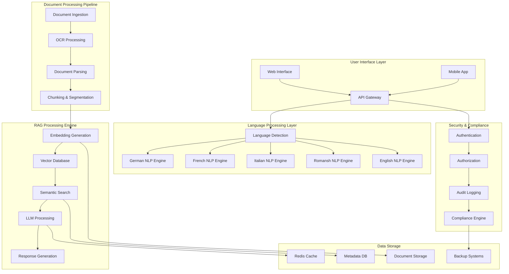
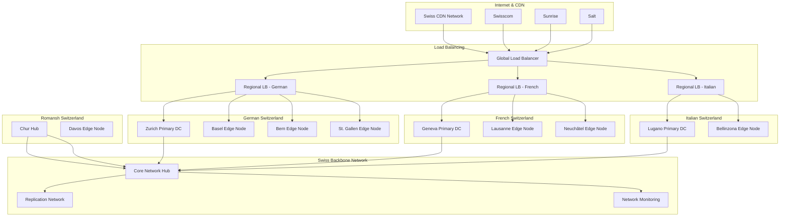
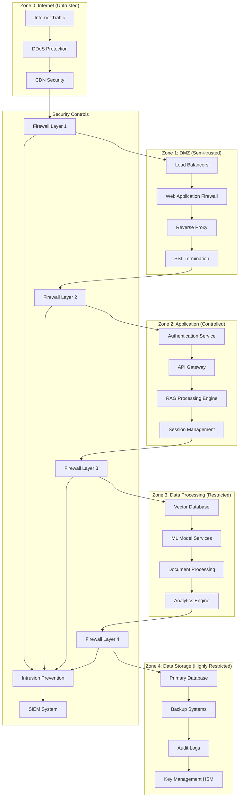
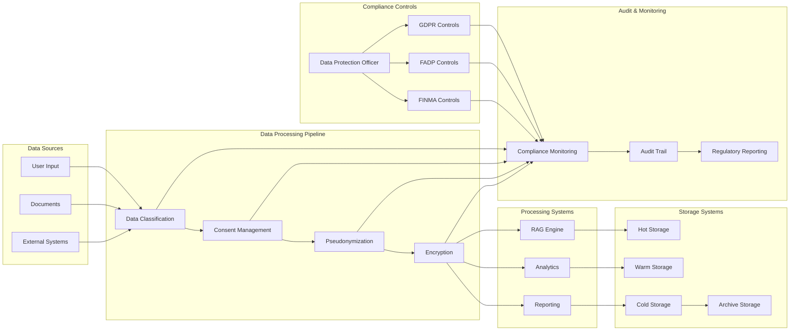
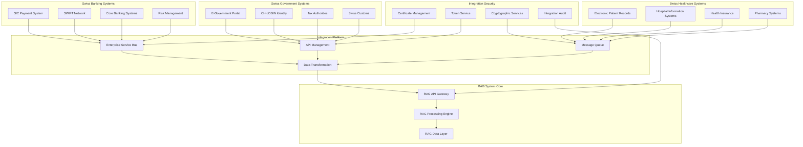

# Swiss Technical Architecture Specification

**Document Version**: 1.0  
**Classification**: Confidential - Swiss Market Technical Requirements  
**Last Updated**: July 2025  
**Valid Until**: July 2027  

## Executive Summary

This document defines the comprehensive technical architecture requirements for deploying enterprise RAG systems within the Swiss market. It addresses the unique technical challenges of Switzerland's multi-lingual, highly regulated, and geographically distributed environment while ensuring compliance with Swiss federal and cantonal regulations.

## Table of Contents

1. [Swiss Infrastructure Requirements](#1-swiss-infrastructure-requirements)
2. [Multi-Language Processing Architecture](#2-multi-language-processing-architecture)
3. [Swiss Compliance-Driven Architecture](#3-swiss-compliance-driven-architecture)
4. [Integration Architecture](#4-integration-architecture)
5. [Security Architecture](#5-security-architecture)
6. [Performance Architecture](#6-performance-architecture)
7. [Disaster Recovery & Business Continuity](#7-disaster-recovery--business-continuity)
8. [Deployment Models](#8-deployment-models)
9. [Technical Diagrams](#9-technical-diagrams)
10. [Implementation Guidelines](#10-implementation-guidelines)

---

## 1. Swiss Infrastructure Requirements

### 1.1 Data Center Requirements

#### 1.1.1 Geographic Distribution
**REQ-INFRA-001**: Primary data centers MUST be located within Swiss territory
- **Location**: Minimum two facilities in different cantons
- **Separation**: Minimum 100km distance between primary facilities
- **Tier Level**: Minimum Tier III certification required
- **Connectivity**: Direct fiber connections to SwissIX

**REQ-INFRA-002**: Edge computing nodes for cantonal distribution
- **Coverage**: Minimum one edge node per linguistic region
- **German Region**: Zurich, Basel, Bern
- **French Region**: Geneva, Lausanne
- **Italian Region**: Lugano
- **Romansh Region**: Chur

**REQ-INFRA-003**: Hybrid cloud architecture compliance
- **Primary**: On-premises Swiss data centers
- **Secondary**: Swiss-based cloud providers (Swisscom, Green.ch)
- **Tertiary**: EU-compliant cloud regions only if data sovereignty maintained

#### 1.1.2 Physical Infrastructure Standards

**REQ-INFRA-004**: Power and cooling systems
- **Redundancy**: N+1 minimum for all critical systems
- **UPS**: Minimum 15-minute battery backup
- **Generators**: Minimum 72-hour fuel capacity
- **Cooling**: Free cooling utilization for Swiss climate efficiency

**REQ-INFRA-005**: Network infrastructure
- **Bandwidth**: Minimum 10Gbps inter-facility connections
- **Latency**: Maximum 5ms between primary facilities
- **Providers**: Minimum two different Swiss telecom providers
- **IPv6**: Full IPv6 support mandatory

### 1.2 Network Architecture

#### 1.2.1 Swiss Network Topology

**REQ-NET-001**: Multi-tier network architecture
```
Internet Layer
├── Swiss Telecom Providers (Swisscom, Sunrise, Salt)
├── SwissIX Peering
└── International Gateways

DMZ Layer
├── Load Balancers (F5/HAProxy)
├── Web Application Firewalls
├── DDoS Protection
└── SSL/TLS Termination

Application Layer
├── API Gateway Cluster
├── Authentication Services
├── RAG Processing Engines
└── Document Management

Data Layer
├── Vector Database Cluster
├── Relational Database Cluster
├── Document Storage (S3-compatible)
└── Backup Systems
```

**REQ-NET-002**: Software-Defined Networking (SDN)
- **Controller**: Centralized SDN controller for traffic management
- **Segmentation**: Micro-segmentation for tenant isolation
- **QoS**: Quality of Service policies for different service tiers
- **Monitoring**: Real-time network telemetry and analytics

#### 1.2.2 Connectivity Requirements

**REQ-NET-003**: Swiss ISP integration
- **Primary**: Swisscom Business Connect
- **Secondary**: Sunrise Business
- **Tertiary**: Salt Business
- **Peering**: Direct SwissIX peering for major traffic flows

**REQ-NET-004**: International connectivity
- **European**: Direct connections to Frankfurt, Milan, Paris
- **Global**: Minimum 99.9% uptime SLA
- **Redundancy**: Multiple submarine cable paths
- **Latency**: Maximum 150ms to major global financial centers

### 1.3 Security Zones

#### 1.3.1 Zone Architecture

**REQ-SEC-ZONE-001**: Five-tier security zone model
```
Zone 0: Internet/Public (Untrusted)
├── Public websites and documentation
├── Marketing and general information
└── No sensitive data processing

Zone 1: DMZ/Perimeter (Semi-trusted)
├── Load balancers and reverse proxies
├── Web application firewalls
├── Rate limiting and DDoS protection
└── SSL/TLS termination

Zone 2: Application Layer (Controlled)
├── API gateways and authentication
├── RAG processing engines
├── Document processing services
└── User session management

Zone 3: Data Processing (Restricted)
├── Vector databases and search engines
├── Machine learning model servers
├── Document storage and indexing
└── Analytics and reporting

Zone 4: Data Storage (Highly Restricted)
├── Primary data storage systems
├── Backup and archive systems
├── Audit logs and compliance data
└── Cryptographic key management
```

**REQ-SEC-ZONE-002**: Inter-zone communication protocols
- **Encryption**: TLS 1.3 minimum for all inter-zone traffic
- **Authentication**: Mutual TLS (mTLS) for service-to-service
- **Authorization**: Zero-trust network access (ZTNA) model
- **Monitoring**: All inter-zone traffic logged and analyzed

#### 1.3.2 Swiss Banking Security Standards

**REQ-SEC-ZONE-003**: Banking-grade security zones
- **Compliance**: FINMA Circular 2018/3 requirements
- **Segregation**: Complete logical separation of banking data
- **Access Control**: Role-based access with four-eyes principle
- **Monitoring**: Real-time security event correlation

**REQ-SEC-ZONE-004**: Government sector security zones
- **Compliance**: ISB (Swiss Federal IT Steering Unit) guidelines
- **Classification**: Handling of CONFIDENTIAL and SECRET data
- **Access Control**: Swiss government PKI integration
- **Monitoring**: MELANI (Swiss Cyber Security Centre) integration

---

## 2. Multi-Language Processing Architecture

### 2.1 Language Processing Framework

#### 2.1.1 Core Language Support

**REQ-LANG-001**: Comprehensive Swiss language support
- **German**: Standard High German (Hochdeutsch) and Swiss German variants
- **French**: Standard French and Swiss French regional variations
- **Italian**: Standard Italian and Ticinese dialect support
- **Romansh**: All five written standards (Sursilvan, Sutsilvan, Surmiran, Puter, Vallader)
- **English**: International English for business contexts

**REQ-LANG-002**: Multi-lingual document processing pipeline
```
Document Ingestion
├── Language Detection (99.5% accuracy minimum)
├── Character Encoding Normalization (UTF-8)
├── OCR with Language-Specific Models
└── Format Standardization

Language Processing
├── Tokenization (Language-Specific)
├── Named Entity Recognition (Swiss Entities)
├── Semantic Analysis
└── Context Extraction

Vector Generation
├── Language-Specific Embeddings
├── Cross-Language Semantic Mapping
├── Cultural Context Preservation
└── Regional Variant Handling
```

#### 2.1.2 Natural Language Processing Pipeline

**REQ-LANG-003**: Advanced NLP capabilities
- **Tokenization**: Language-aware tokenization for all Swiss languages
- **Stemming/Lemmatization**: Morphological analysis for German compounds
- **POS Tagging**: Part-of-speech tagging with 98% accuracy minimum
- **NER**: Swiss-specific named entity recognition (places, organizations, laws)

**REQ-LANG-004**: Swiss-specific linguistic models
- **Legal Terms**: Swiss legal terminology in all official languages
- **Geographic Names**: Swiss place names and administrative divisions
- **Business Terms**: Swiss business and financial terminology
- **Cultural Context**: Swiss cultural references and idioms

### 2.2 Cross-Language Search and Retrieval

#### 2.2.1 Multi-Lingual Search Architecture

**REQ-LANG-005**: Cross-language information retrieval
```
Query Processing
├── Language Detection and Classification
├── Query Expansion with Synonyms
├── Cross-Language Query Translation
└── Semantic Intent Recognition

Document Matching
├── Mono-lingual Exact Matching
├── Cross-lingual Semantic Matching
├── Cultural Context Matching
└── Legal/Regulatory Context Matching

Result Ranking
├── Language Preference Weighting
├── Semantic Relevance Scoring
├── Authority/Source Credibility
└── Freshness and Currency
```

**REQ-LANG-006**: Translation and localization services
- **Machine Translation**: Custom Swiss language models
- **Human Translation**: Integration with Swiss translation services
- **Localization**: Canton-specific terminology and regulations
- **Quality Assurance**: Translation validation and accuracy metrics

#### 2.2.2 Semantic Search Capabilities

**REQ-LANG-007**: Advanced semantic understanding
- **Concept Mapping**: Cross-language concept identification
- **Context Preservation**: Maintaining meaning across translations
- **Disambiguation**: Handling polysemous terms in different languages
- **Inference**: Logical reasoning across language boundaries

**REQ-LANG-008**: Cultural and regional adaptation
- **Swiss German**: Handling of Allemannisch variations
- **Regional Laws**: Canton-specific legal terminology
- **Business Practices**: Swiss business culture terminology
- **Technical Terms**: Swiss technical and engineering terminology

### 2.3 Language Model Architecture

#### 2.3.1 Swiss Language Models

**REQ-LANG-009**: Specialized language models
- **Swiss German Model**: Trained on Swiss German text corpus
- **Swiss French Model**: Incorporating Swiss French variations
- **Swiss Italian Model**: Ticinese and standard Italian support
- **Romansh Models**: Separate models for each written standard
- **Legal Language Model**: Swiss legal text processing

**REQ-LANG-010**: Model training and maintenance
- **Training Data**: Swiss-specific text corpora
- **Update Frequency**: Quarterly model updates minimum
- **Quality Metrics**: Perplexity, BLEU scores, human evaluation
- **Bias Detection**: Continuous bias monitoring and mitigation

#### 2.3.2 Performance Requirements

**REQ-LANG-011**: Language processing performance
- **Latency**: Maximum 500ms for language detection
- **Throughput**: Minimum 1000 documents per minute processing
- **Accuracy**: Minimum 95% accuracy for language identification
- **Scalability**: Horizontal scaling across language services

**REQ-LANG-012**: Resource optimization
- **Memory**: Efficient memory usage for large language models
- **GPU Utilization**: Optimal GPU resource allocation
- **Caching**: Intelligent caching of language processing results
- **Load Balancing**: Language-aware load distribution

---

## 3. Swiss Compliance-Driven Architecture

### 3.1 Regulatory Compliance Framework

#### 3.1.1 Federal Compliance Requirements

**REQ-COMP-001**: Swiss Federal Data Protection Act (FADP) compliance
- **Data Minimization**: Collect and process only necessary data
- **Purpose Limitation**: Use data only for specified, legitimate purposes
- **Storage Limitation**: Retain data only as long as necessary
- **Data Subject Rights**: Implement rights of access, rectification, and erasure

**REQ-COMP-002**: Swiss Code of Obligations compliance
- **Contractual Obligations**: Ensure all data processing contracts comply
- **Liability**: Clear liability frameworks for data processing
- **Documentation**: Comprehensive record-keeping for all processing
- **Cross-border**: Special provisions for international data transfers

#### 3.1.2 Sector-Specific Compliance

**REQ-COMP-003**: FINMA compliance for financial services
- **Circular 2018/3**: Cloud computing risk management
- **Operational Risk**: Comprehensive operational risk management
- **Outsourcing**: Strict outsourcing governance framework
- **Audit Rights**: Full audit rights and transparency

**REQ-COMP-004**: Swiss healthcare compliance (KVG/LAMal)
- **Patient Data**: Special protection for health data
- **Consent Management**: Explicit consent for health data processing
- **Professional Secrecy**: Medical professional confidentiality
- **Cross-border**: Restrictions on health data transfers

### 3.2 Architecture Patterns for Compliance

#### 3.2.1 Privacy-by-Design Architecture

**REQ-COMP-005**: Privacy-preserving system design
```
Data Collection Layer
├── Consent Management System
├── Data Minimization Controls
├── Purpose-Binding Mechanisms
└── Retention Policy Enforcement

Processing Layer
├── Pseudonymization Services
├── Anonymization Pipelines
├── Differential Privacy
└── Secure Multi-party Computation

Storage Layer
├── Encrypted Data Stores
├── Access Control Matrices
├── Audit Trail Systems
└── Data Lineage Tracking
```

**REQ-COMP-006**: Data governance framework
- **Data Classification**: Automatic data classification and labeling
- **Access Controls**: Role-based and attribute-based access control
- **Audit Trails**: Immutable audit logs for all data access
- **Data Lineage**: Complete data provenance tracking

#### 3.2.2 Compliance Monitoring Architecture

**REQ-COMP-007**: Automated compliance monitoring
- **Policy Engine**: Automated policy enforcement
- **Violation Detection**: Real-time compliance violation detection
- **Reporting**: Automated compliance reporting
- **Remediation**: Automated remediation workflows

**REQ-COMP-008**: Regulatory reporting systems
- **Swiss Authorities**: Automated reporting to Swiss regulators
- **International**: Support for international regulatory reporting
- **Audit Support**: Comprehensive audit trail generation
- **Documentation**: Automated compliance documentation

### 3.3 Swiss Legal Framework Integration

#### 3.3.1 Legal System Integration

**REQ-COMP-009**: Swiss legal reference integration
- **Federal Laws**: Integration with Swiss federal legislation database
- **Cantonal Laws**: Support for cantonal legal variations
- **International Treaties**: Swiss international treaty obligations
- **Legal Updates**: Automatic updates for legal changes

**REQ-COMP-010**: Legal document processing
- **Legal Citation**: Automatic legal citation recognition
- **Precedent Analysis**: Case law and precedent integration
- **Legal Hierarchy**: Understanding of Swiss legal hierarchy
- **Multi-lingual Legal**: Legal terms in all Swiss languages

#### 3.3.2 Compliance Validation

**REQ-COMP-011**: Continuous compliance validation
- **Automated Checks**: Regular automated compliance checks
- **Manual Reviews**: Scheduled manual compliance reviews
- **Third-party Audits**: Support for external compliance audits
- **Certification**: Ongoing certification maintenance

**REQ-COMP-012**: Compliance reporting and analytics
- **Dashboard**: Real-time compliance status dashboard
- **Metrics**: Key compliance performance indicators
- **Trends**: Compliance trend analysis and prediction
- **Alerts**: Proactive compliance risk alerting

---

## 4. Integration Architecture

### 4.1 Swiss Banking System Integration

#### 4.1.1 Core Banking Integration

**REQ-INT-BANK-001**: Swiss banking standard protocols
- **SIC (Swiss Interbank Clearing)**: Direct SIC system integration
- **ISO 20022**: Full ISO 20022 message format support
- **SEPA**: Single Euro Payments Area integration
- **SWIFT**: Secure SWIFT message processing

**REQ-INT-BANK-002**: Banking security integration
```
Authentication Layer
├── Swiss Banking PKI Integration
├── Two-Factor Authentication (2FA)
├── Hardware Security Module (HSM) Support
└── Biometric Authentication Support

Authorization Layer
├── Role-Based Access Control (RBAC)
├── Attribute-Based Access Control (ABAC)
├── Time-Based Access Restrictions
└── Geographic Access Controls

Audit Layer
├── Transaction Audit Trails
├── Access Log Management
├── Regulatory Reporting
└── Forensic Investigation Support
```

**REQ-INT-BANK-003**: Real-time banking data processing
- **Transaction Processing**: Real-time transaction data ingestion
- **Risk Assessment**: Integrated risk assessment workflows
- **Compliance Checking**: Real-time compliance validation
- **Fraud Detection**: ML-powered fraud detection integration

#### 4.1.2 Swiss Payment Systems

**REQ-INT-BANK-004**: Payment system integration
- **Twint**: Swiss mobile payment system integration
- **PostFinance**: Swiss postal banking system
- **Digital Banking**: Integration with Swiss digital banking platforms
- **Cryptocurrency**: Swiss crypto asset platform integration

**REQ-INT-BANK-005**: Financial data standards
- **XBRL**: Extensible Business Reporting Language support
- **FpML**: Financial products Markup Language
- **FIX Protocol**: Financial Information eXchange protocol
- **Swiss GAAP FER**: Swiss accounting standards integration

### 4.2 Swiss Government System Integration

#### 4.2.1 E-Government Integration

**REQ-INT-GOV-001**: Swiss e-government standards
- **CH-LOGIN**: Swiss national digital identity integration
- **eGov Standards**: Swiss e-government interoperability standards
- **Federal Portal**: Integration with Swiss federal portal
- **Cantonal Systems**: Support for cantonal government systems

**REQ-INT-GOV-002**: Government data exchange
```
Federal Level
├── Federal Statistical Office (FSO)
├── Federal Tax Administration (FTA)
├── Federal Office for Migration (FOM)
└── Swiss Business Register

Cantonal Level
├── Cantonal Tax Authorities
├── Commercial Registers
├── Land Registries
└── Civil Status Offices

Municipal Level
├── Municipal Administration Systems
├── Public Service Portals
├── Local Tax Systems
└── Permit and License Systems
```

#### 4.2.2 Regulatory Reporting Integration

**REQ-INT-GOV-003**: Automated regulatory reporting
- **FINMA**: Financial market regulatory reporting
- **SECO**: Economic regulatory reporting
- **FOEN**: Environmental regulatory reporting
- **BAKOM**: Communications regulatory reporting

**REQ-INT-GOV-004**: Legal compliance integration
- **Legal Database**: Swiss legal database integration
- **Case Management**: Legal case management systems
- **Document Management**: Legal document management
- **Workflow Integration**: Legal workflow automation

### 4.3 Swiss Healthcare System Integration

#### 4.3.1 Healthcare Standards Integration

**REQ-INT-HEALTH-001**: Swiss healthcare standards
- **Swiss EPR**: Electronic Patient Record integration
- **HL7 FHIR**: Healthcare data interoperability
- **IHE Profiles**: Integrating the Healthcare Enterprise profiles
- **SNOMED CT**: Systematized Nomenclature of Medicine Clinical Terms

**REQ-INT-HEALTH-002**: Healthcare data integration
```
Clinical Systems
├── Hospital Information Systems (HIS)
├── Electronic Health Records (EHR)
├── Laboratory Information Systems (LIS)
└── Radiology Information Systems (RIS)

Insurance Systems
├── Swiss Health Insurance Integration
├── Claims Processing Systems
├── Reimbursement Systems
└── Fraud Detection Systems

Public Health
├── Swiss Federal Office of Public Health
├── Cantonal Health Departments
├── Epidemiological Surveillance
└── Health Statistics Systems
```

#### 4.3.2 Medical Data Security

**REQ-INT-HEALTH-003**: Healthcare data protection
- **Patient Consent**: Granular patient consent management
- **Data Anonymization**: Healthcare data anonymization
- **Access Control**: Medical professional access control
- **Audit Trails**: Comprehensive medical data audit trails

**REQ-INT-HEALTH-004**: Healthcare interoperability
- **Cross-border**: EU healthcare data exchange
- **Standards Compliance**: International healthcare standards
- **Quality Assurance**: Healthcare data quality management
- **Emergency Access**: Emergency healthcare data access protocols

### 4.4 Swiss Enterprise System Integration

#### 4.4.1 ERP and Business System Integration

**REQ-INT-ENT-001**: Swiss ERP system integration
- **SAP Switzerland**: Localized SAP implementations
- **Swiss Accounting**: Swiss accounting system integration
- **HR Systems**: Swiss HR and payroll systems
- **CRM Systems**: Customer relationship management integration

**REQ-INT-ENT-002**: Supply chain integration
- **Swiss Supply Chain**: Local supply chain systems
- **Customs Integration**: Swiss customs and trade systems
- **Logistics**: Swiss logistics and transportation systems
- **Quality Management**: Swiss quality management standards

#### 4.4.2 Document Management Integration

**REQ-INT-ENT-003**: Enterprise document management
- **SharePoint**: Microsoft SharePoint integration
- **Swiss DMS**: Swiss document management systems
- **ECM Systems**: Enterprise content management
- **Workflow Systems**: Document workflow integration

**REQ-INT-ENT-004**: Collaboration platform integration
- **Swiss Cloud**: Swiss cloud collaboration platforms
- **Microsoft 365**: Localized Microsoft 365 integration
- **Google Workspace**: Swiss Google Workspace integration
- **Communication**: Swiss communication platforms

---

## 5. Security Architecture

### 5.1 Swiss Banking Security Standards

#### 5.1.1 FINMA Security Requirements

**REQ-SEC-BANK-001**: FINMA Circular 2018/3 compliance
```
Governance Layer
├── Information Security Governance
├── Risk Management Framework
├── Incident Response Procedures
└── Third-Party Risk Management

Technical Layer
├── Multi-Factor Authentication (MFA)
├── End-to-End Encryption
├── Network Segmentation
├── Vulnerability Management
└── Security Monitoring (24/7)

Operational Layer
├── Security Awareness Training
├── Regular Security Assessments
├── Business Continuity Planning
└── Disaster Recovery Testing
```

**REQ-SEC-BANK-002**: Banking-grade access controls
- **Authentication**: Multi-factor authentication mandatory
- **Authorization**: Principle of least privilege
- **Session Management**: Secure session handling
- **Privileged Access**: Privileged access management (PAM)

#### 5.1.2 Cryptographic Standards

**REQ-SEC-BANK-003**: Swiss banking cryptography
- **Algorithms**: NIST-approved and Swiss-validated algorithms
- **Key Management**: Hardware Security Module (HSM) integration
- **Certificates**: Swiss PKI infrastructure integration
- **Quantum-Ready**: Post-quantum cryptography preparation

**REQ-SEC-BANK-004**: Data protection encryption
```
Data at Rest
├── AES-256 encryption minimum
├── Hardware-based encryption preferred
├── Key rotation (90-day maximum)
└── Secure key escrow procedures

Data in Transit
├── TLS 1.3 minimum for all connections
├── Perfect Forward Secrecy (PFS)
├── Certificate pinning
└── End-to-end encryption for sensitive data

Data in Use
├── Homomorphic encryption for analytics
├── Secure enclaves for processing
├── Trusted execution environments
└── Memory encryption capabilities
```

### 5.2 Multi-Layered Security Architecture

#### 5.2.1 Defense in Depth Strategy

**REQ-SEC-LAYER-001**: Seven-layer security model
```
Layer 1: Physical Security
├── Biometric access controls
├── Security cameras and monitoring
├── Environmental controls
└── Physical asset tracking

Layer 2: Network Security
├── Next-generation firewalls
├── Intrusion detection/prevention
├── Network access control (NAC)
└── Network segmentation

Layer 3: Endpoint Security
├── Endpoint detection and response
├── Device encryption
├── Mobile device management
└── Patch management

Layer 4: Application Security
├── Web application firewalls
├── API security gateways
├── Code analysis (SAST/DAST)
└── Runtime application protection

Layer 5: Data Security
├── Data loss prevention (DLP)
├── Database security monitoring
├── Data classification and labeling
└── Rights management

Layer 6: Identity Security
├── Identity and access management
├── Privileged access management
├── Single sign-on (SSO)
└── Identity governance

Layer 7: Security Operations
├── Security information and event management
├── Security orchestration and response
├── Threat intelligence integration
└── Incident response automation
```

#### 5.2.2 Zero Trust Architecture

**REQ-SEC-LAYER-002**: Zero Trust implementation
- **Identity Verification**: Continuous identity verification
- **Device Validation**: Device trust and compliance validation
- **Network Micro-segmentation**: Granular network controls
- **Application Protection**: Application-level security controls

**REQ-SEC-LAYER-003**: Continuous security validation
- **Risk Assessment**: Continuous risk assessment and scoring
- **Behavioral Analytics**: User and entity behavior analytics
- **Threat Detection**: AI-powered threat detection and response
- **Adaptive Controls**: Dynamic security control adjustment

### 5.3 Swiss Regulatory Security Compliance

#### 5.3.1 Swiss Federal Security Standards

**REQ-SEC-REG-001**: ISB (Swiss Federal IT Steering Unit) compliance
- **Security Zones**: Swiss government security zone model
- **Classification**: Swiss information classification standards
- **Personnel Security**: Swiss personnel security clearance
- **Physical Security**: Swiss physical security standards

**REQ-SEC-REG-002**: MELANI integration
- **Threat Intelligence**: Swiss cyber threat intelligence integration
- **Incident Reporting**: Mandatory cyber incident reporting
- **Early Warning**: Cyber security early warning system
- **Information Sharing**: Secure information sharing protocols

#### 5.3.2 Industry-Specific Security

**REQ-SEC-REG-003**: Critical infrastructure protection
- **Energy Sector**: Swiss energy sector security requirements
- **Transportation**: Swiss transportation security standards
- **Communications**: Swiss telecommunications security framework
- **Water/Utilities**: Swiss utilities security requirements

**REQ-SEC-REG-004**: Cross-border security coordination
- **EU Cybersecurity**: EU cybersecurity framework alignment
- **International Standards**: ISO 27001/27002 compliance
- **Mutual Recognition**: Security certification mutual recognition
- **Information Sharing**: International threat intelligence sharing

### 5.4 Advanced Threat Protection

#### 5.4.1 AI-Powered Security

**REQ-SEC-THREAT-001**: Machine learning security
```
Threat Detection
├── Anomaly Detection Algorithms
├── Behavioral Analysis Models
├── Predictive Threat Intelligence
└── Automated Incident Classification

Response Automation
├── Automated Threat Response
├── Security Orchestration
├── Incident Investigation Automation
└── Remediation Workflow Automation

Continuous Learning
├── Threat Model Updates
├── Security Pattern Recognition
├── False Positive Reduction
└── Adaptive Defense Mechanisms
```

#### 5.4.2 Advanced Persistent Threat (APT) Protection

**REQ-SEC-THREAT-002**: APT detection and response
- **Lateral Movement Detection**: Advanced lateral movement detection
- **Command and Control**: C&C communication detection
- **Data Exfiltration Prevention**: Advanced DLP capabilities
- **Attribution Analysis**: Threat actor attribution and analysis

**REQ-SEC-THREAT-003**: Threat hunting capabilities
- **Proactive Hunting**: Continuous threat hunting programs
- **Threat Intelligence**: Strategic threat intelligence integration
- **Digital Forensics**: Advanced digital forensics capabilities
- **Malware Analysis**: Automated malware analysis sandboxes

---

## 6. Performance Architecture

### 6.1 Low-Latency Design for Swiss Geography

#### 6.1.1 Geographic Performance Optimization

**REQ-PERF-GEO-001**: Cantonal latency requirements
```
Latency Targets (95th percentile)
├── Same Canton: <10ms
├── Adjacent Cantons: <20ms
├── Cross-Country (ZH-GE): <30ms
├── Alpine Regions: <50ms
└── International (EU): <100ms
```

**REQ-PERF-GEO-002**: Swiss network topology optimization
- **Edge Nodes**: Strategic placement in major Swiss cities
- **CDN Integration**: Swiss CDN provider integration
- **Traffic Routing**: Intelligent traffic routing based on location
- **Caching Strategy**: Geographic-based caching policies

#### 6.1.2 Multi-Region Architecture

**REQ-PERF-GEO-003**: Swiss multi-region deployment
```
Primary Regions
├── German Switzerland (Zurich Hub)
│   ├── Edge: Basel, Bern, St. Gallen
│   ├── Coverage: German-speaking cantons
│   └── Capacity: 60% of total traffic

├── French Switzerland (Geneva Hub)
│   ├── Edge: Lausanne, Neuchâtel
│   ├── Coverage: French-speaking cantons
│   └── Capacity: 25% of total traffic

├── Italian Switzerland (Lugano Hub)
│   ├── Edge: Bellinzona
│   ├── Coverage: Ticino canton
│   └── Capacity: 10% of total traffic

└── Romansh Switzerland (Chur Hub)
    ├── Edge: St. Moritz, Davos
    ├── Coverage: Graubünden canton
    └── Capacity: 5% of total traffic
```

### 6.2 High-Performance Computing Architecture

#### 6.2.1 Vector Database Performance

**REQ-PERF-VEC-001**: Vector search optimization
- **Indexing**: HNSW (Hierarchical Navigable Small World) indexing
- **Quantization**: Product quantization for memory efficiency
- **Caching**: Intelligent vector cache management
- **Parallelization**: Multi-threaded vector operations

**REQ-PERF-VEC-002**: Large-scale vector operations
```
Performance Targets
├── Index Size: Up to 100M vectors
├── Query Latency: <100ms (p95)
├── Throughput: 10,000 QPS sustained
├── Accuracy: >95% recall@10
└── Memory Usage: <50% of available RAM
```

#### 6.2.2 Distributed Computing Framework

**REQ-PERF-DIST-001**: Distributed processing architecture
- **Compute Clusters**: Kubernetes-based compute clusters
- **Load Balancing**: Intelligent workload distribution
- **Auto-scaling**: Dynamic resource allocation
- **Resource Optimization**: GPU/CPU resource optimization

**REQ-PERF-DIST-002**: Data processing pipelines
```
Batch Processing
├── Apache Spark clusters for large datasets
├── Scheduled ETL operations
├── Data validation and quality checks
└── Performance monitoring and optimization

Stream Processing
├── Apache Kafka for real-time data streams
├── Apache Flink for stream processing
├── Real-time analytics and alerting
└── Event-driven architecture patterns

Hybrid Processing
├── Lambda architecture implementation
├── Batch and stream processing coordination
├── Data consistency management
└── Performance optimization across layers
```

### 6.3 Scalability and Elasticity

#### 6.3.1 Auto-Scaling Architecture

**REQ-PERF-SCALE-001**: Dynamic scaling capabilities
```
Horizontal Scaling
├── Container orchestration (Kubernetes)
├── Database sharding and replication
├── Load balancer configuration
└── Service mesh implementation

Vertical Scaling
├── Dynamic resource allocation
├── Memory and CPU optimization
├── Storage performance tuning
└── Network bandwidth scaling

Predictive Scaling
├── Machine learning-based demand forecasting
├── Proactive resource provisioning
├── Seasonal pattern recognition
└── Business event-driven scaling
```

**REQ-PERF-SCALE-002**: Resource optimization strategies
- **Cost Optimization**: Resource cost optimization algorithms
- **Performance Tuning**: Continuous performance optimization
- **Capacity Planning**: Data-driven capacity planning
- **Resource Monitoring**: Real-time resource utilization monitoring

#### 6.3.2 Swiss-Specific Performance Requirements

**REQ-PERF-SWISS-001**: Multi-lingual performance optimization
- **Language Detection**: <50ms language detection latency
- **Translation**: <500ms translation processing time
- **Cross-lingual Search**: <200ms cross-language query processing
- **Model Loading**: <2s language model initialization

**REQ-PERF-SWISS-002**: Regulatory performance requirements
- **Audit Queries**: <1s audit trail query response time
- **Compliance Checks**: <100ms compliance validation
- **Reporting**: <30s regulatory report generation
- **Data Lineage**: <500ms data provenance tracking

### 6.4 Performance Monitoring and Optimization

#### 6.4.1 Comprehensive Performance Monitoring

**REQ-PERF-MON-001**: Real-time performance monitoring
```
Application Performance Monitoring (APM)
├── Request tracing and profiling
├── Database query performance
├── API response time monitoring
└── Error rate and availability tracking

Infrastructure Monitoring
├── Server resource utilization
├── Network performance metrics
├── Storage I/O performance
└── Container and orchestration metrics

User Experience Monitoring
├── Real user monitoring (RUM)
├── Synthetic transaction monitoring
├── Page load time analysis
└── Mobile application performance
```

**REQ-PERF-MON-002**: Performance analytics and optimization
- **Bottleneck Identification**: Automated performance bottleneck detection
- **Optimization Recommendations**: AI-powered optimization suggestions
- **Capacity Forecasting**: Predictive capacity planning
- **Performance Alerts**: Proactive performance alert system

#### 6.4.2 Swiss Performance Standards

**REQ-PERF-STD-001**: Swiss industry performance benchmarks
- **Banking**: Sub-second transaction processing
- **Government**: 24/7 service availability (99.9% uptime)
- **Healthcare**: HIPAA-equivalent response time requirements
- **Enterprise**: Business hours performance guarantees

**REQ-PERF-STD-002**: Performance SLA framework
```
Service Level Agreements
├── Availability: 99.95% uptime minimum
├── Response Time: 95th percentile targets
├── Throughput: Peak load handling capacity
├── Recovery Time: Maximum downtime limits
└── Performance Degradation: Graceful degradation policies
```

---

## 7. Disaster Recovery & Business Continuity

### 7.1 Swiss-Specific Disaster Recovery Planning

#### 7.1.1 Geographic Risk Assessment

**REQ-DR-RISK-001**: Swiss natural disaster considerations
```
Natural Disasters
├── Alpine Avalanches and Landslides
│   ├── Risk Areas: Alpine cantons (GR, VS, BE, UR)
│   ├── Impact: Data center access disruption
│   └── Mitigation: Redundant connectivity paths

├── Flooding (Rhine, Rhône, Po valleys)
│   ├── Risk Areas: Basel, Geneva, Ticino regions
│   ├── Impact: Data center infrastructure damage
│   └── Mitigation: Elevated facility placement

├── Earthquakes (Basel fault line)
│   ├── Risk Areas: Northwest Switzerland
│   ├── Impact: Structural facility damage
│   └── Mitigation: Seismic-resistant construction

└── Severe Weather Events
    ├── Risk Areas: All cantons
    ├── Impact: Power and network outages
    └── Mitigation: Redundant power systems
```

**REQ-DR-RISK-002**: Swiss infrastructure dependencies
- **Power Grid**: SwissGrid dependency analysis and backup power
- **Telecommunications**: Swisscom/Sunrise/Salt redundancy planning
- **Transportation**: Swiss transport network impact assessment
- **Supply Chain**: Swiss supplier and vendor contingency planning

#### 7.1.2 Multi-Site Disaster Recovery Architecture

**REQ-DR-ARCH-001**: Swiss disaster recovery topology
```
Primary Sites (Active-Active)
├── Site A: Zurich Region
│   ├── Primary Data Center (Tier III+)
│   ├── Backup Data Center (Tier III)
│   └── Edge Computing Nodes (3)

└── Site B: Geneva Region
    ├── Primary Data Center (Tier III+)
    ├── Backup Data Center (Tier III)
    └── Edge Computing Nodes (2)

Tertiary Sites (Cold Standby)
├── Site C: Basel Region
│   ├── Cold standby data center
│   └── Emergency command center

└── Site D: Lugano Region
    ├── Cold standby data center
    └── Regional backup facility
```

**REQ-DR-ARCH-002**: Data replication and synchronization
- **Synchronous Replication**: Critical data replicated synchronously
- **Asynchronous Replication**: Non-critical data replicated asynchronously
- **Cross-Site Validation**: Regular data consistency validation
- **Bandwidth Optimization**: Efficient replication bandwidth usage

### 7.2 Business Continuity Framework

#### 7.2.1 Swiss Regulatory Business Continuity

**REQ-BC-REG-001**: FINMA business continuity requirements
```
Critical Business Functions
├── Payment Processing
│   ├── RTO: 15 minutes maximum
│   ├── RPO: Zero data loss
│   └── Backup Systems: Hot standby required

├── Customer Access Services
│   ├── RTO: 30 minutes maximum
│   ├── RPO: 5 minutes maximum
│   └── Backup Systems: Warm standby acceptable

├── Regulatory Reporting
│   ├── RTO: 4 hours maximum
│   ├── RPO: 1 hour maximum
│   └── Backup Systems: Cold standby acceptable

└── Internal Operations
    ├── RTO: 8 hours maximum
    ├── RPO: 4 hours maximum
    └── Backup Systems: Manual processes acceptable
```

**REQ-BC-REG-002**: Swiss government continuity requirements
- **Essential Services**: 24/7 availability for critical government services
- **Emergency Response**: Integration with Swiss emergency response systems
- **Public Communication**: Capability to communicate during emergencies
- **Cross-cantonal Coordination**: Support for inter-cantonal coordination

#### 7.2.2 Business Impact Analysis

**REQ-BC-BIA-001**: Swiss business impact assessment
```
Impact Categories
├── Financial Impact
│   ├── Revenue Loss per Hour
│   ├── Regulatory Fines and Penalties
│   ├── Customer Compensation
│   └── Recovery Costs

├── Operational Impact
│   ├── Process Disruption
│   ├── Service Level Degradation
│   ├── Customer Satisfaction Impact
│   └── Employee Productivity Loss

├── Reputational Impact
│   ├── Brand Damage Assessment
│   ├── Customer Trust Impact
│   ├── Media Coverage Impact
│   └── Competitor Advantage Loss

└── Regulatory Impact
    ├── Compliance Violation Penalties
    ├── License Suspension Risk
    ├── Regulatory Investigation Impact
    └── Legal Action Exposure
```

### 7.3 Recovery Procedures and Testing

#### 7.3.1 Disaster Recovery Procedures

**REQ-DR-PROC-001**: Automated disaster recovery workflows
```
Detection and Assessment
├── Automated Monitoring and Alerting
├── Disaster Impact Assessment
├── Recovery Decision Matrix
└── Stakeholder Notification

Recovery Activation
├── Automated Failover Procedures
├── Data Recovery Validation
├── Service Restoration Sequence
└── User Communication

Post-Recovery
├── Service Validation Testing
├── Data Integrity Verification
├── Performance Monitoring
└── Lessons Learned Documentation
```

**REQ-DR-PROC-002**: Manual override procedures
- **Emergency Contacts**: 24/7 emergency contact procedures
- **Manual Failover**: Manual disaster recovery activation
- **Communication Plans**: Emergency communication procedures
- **Decision Authority**: Clear decision-making authority during disasters

#### 7.3.2 Business Continuity Testing

**REQ-BC-TEST-001**: Comprehensive testing program
```
Testing Types
├── Tabletop Exercises (Quarterly)
│   ├── Scenario-based discussions
│   ├── Decision-making validation
│   ├── Communication testing
│   └── Process review

├── Functional Testing (Bi-annual)
│   ├── Failover testing
│   ├── Recovery time validation
│   ├── Data integrity verification
│   └── Service restoration testing

├── Full-scale Testing (Annual)
│   ├── Complete disaster simulation
│   ├── End-to-end recovery testing
│   ├── Stakeholder involvement
│   └── Public communication testing

└── Component Testing (Monthly)
    ├── Backup system validation
    ├── Network failover testing
    ├── Data replication verification
    └── Monitoring system testing
```

**REQ-BC-TEST-002**: Swiss-specific testing scenarios
- **Alpine Isolation**: Testing with limited connectivity to alpine regions
- **Cross-border Coordination**: Testing with EU partner systems
- **Multi-lingual Communication**: Testing emergency communications in all languages
- **Regulatory Notification**: Testing regulatory authority notification procedures

### 7.4 Recovery Metrics and Continuous Improvement

#### 7.4.1 Recovery Performance Metrics

**REQ-DR-METRICS-001**: Key disaster recovery metrics
```
Recovery Time Objectives (RTO)
├── Critical Systems: 15 minutes
├── Important Systems: 1 hour
├── Standard Systems: 4 hours
└── Non-critical Systems: 24 hours

Recovery Point Objectives (RPO)
├── Financial Transactions: 0 data loss
├── Customer Data: 5 minutes
├── Operational Data: 1 hour
└── Archived Data: 24 hours

Recovery Testing Metrics
├── Test Success Rate: >95%
├── RTO Achievement: >90%
├── RPO Achievement: >95%
└── Staff Competency: >85%
```

#### 7.4.2 Continuous Improvement Process

**REQ-DR-IMPROVE-001**: Disaster recovery improvement framework
- **Regular Reviews**: Quarterly disaster recovery plan reviews
- **Lessons Learned**: Post-incident and post-test improvement processes
- **Technology Updates**: Regular technology refresh and improvement
- **Staff Training**: Continuous staff training and competency development

**REQ-DR-IMPROVE-002**: Swiss-specific improvements
- **Regulatory Updates**: Incorporating new regulatory requirements
- **Risk Reassessment**: Regular Swiss-specific risk reassessment
- **Technology Evolution**: Adopting new Swiss technology standards
- **International Coordination**: Improving international disaster recovery coordination

---

## 8. Deployment Models

### 8.1 Swiss Banking Deployment Model

#### 8.1.1 Swiss Banking Cloud Architecture

**REQ-DEPLOY-BANK-001**: FINMA-compliant cloud deployment
```
Hybrid Cloud Architecture
├── On-Premises Core (Swiss Data Centers)
│   ├── Core Banking Systems
│   ├── Customer Sensitive Data
│   ├── Regulatory Reporting Systems
│   └── Audit and Compliance Systems

├── Private Cloud (Swiss Cloud Providers)
│   ├── Development and Testing
│   ├── Analytics and Reporting
│   ├── Backup and Archive
│   └── Disaster Recovery

├── Public Cloud (EU-Compliant Regions)
│   ├── Non-sensitive Applications
│   ├── Public-facing Services
│   ├── Content Delivery
│   └── Monitoring and Logging

└── Edge Computing
    ├── Branch Office Applications
    ├── ATM and POS Systems
    ├── Mobile Banking Services
    └── Real-time Fraud Detection
```

**REQ-DEPLOY-BANK-002**: Banking security deployment requirements
- **Network Segmentation**: Complete isolation of banking networks
- **Data Encryption**: End-to-end encryption for all banking data
- **Access Controls**: Banking-grade access control implementation
- **Audit Compliance**: Comprehensive audit trail capabilities

#### 8.1.2 Swiss Banking Integration Patterns

**REQ-DEPLOY-BANK-003**: Core banking system integration
```
Integration Layers
├── API Gateway Layer
│   ├── Authentication and Authorization
│   ├── Rate Limiting and Throttling
│   ├── Request/Response Transformation
│   └── Audit and Logging

├── Service Orchestration Layer
│   ├── Business Process Management
│   ├── Transaction Coordination
│   ├── Service Composition
│   └── Error Handling and Compensation

├── Data Integration Layer
│   ├── Real-time Data Synchronization
│   ├── Batch Data Processing
│   ├── Data Transformation and Validation
│   └── Master Data Management

└── Infrastructure Layer
    ├── Container Orchestration
    ├── Service Mesh
    ├── Configuration Management
    └── Monitoring and Observability
```

### 8.2 Swiss Government Deployment Model

#### 8.2.1 E-Government Architecture

**REQ-DEPLOY-GOV-001**: Swiss government cloud strategy
```
Government Cloud Tiers
├── Sovereign Cloud (Classified Data)
│   ├── Swiss Government Data Centers
│   ├── Classified Document Processing
│   ├── Inter-agency Communications
│   └── National Security Applications

├── Community Cloud (Restricted Data)
│   ├── Shared Government Services
│   ├── Inter-cantonal Cooperation
│   ├── Public Service Delivery
│   └── Citizen Identity Management

├── Hybrid Cloud (Public Services)
│   ├── Public-facing Websites
│   ├── Open Data Platforms
│   ├── Citizen Service Portals
│   └── Public Information Systems

└── Multi-Cloud (Non-sensitive)
    ├── General Office Applications
    ├── Public Communications
    ├── Marketing and Outreach
    └── Training and Development
```

**REQ-DEPLOY-GOV-002**: Government interoperability requirements
- **Standards Compliance**: Swiss e-government interoperability standards
- **Identity Integration**: CH-LOGIN and eID integration
- **Data Exchange**: Standardized government data exchange formats
- **Security Classification**: Support for Swiss information classification levels

#### 8.2.2 Cantonal Deployment Variations

**REQ-DEPLOY-GOV-003**: Canton-specific deployment models
```
Large Cantons (Zurich, Bern, Vaud)
├── Independent IT Infrastructure
├── Dedicated Data Centers
├── Comprehensive Service Portfolios
└── Advanced Technology Adoption

Medium Cantons (Basel, St. Gallen, Aargau)
├── Shared Infrastructure Services
├── Regional Data Center Cooperation
├── Selective Service Implementation
└── Cost-effective Technology Solutions

Small Cantons (Uri, Nidwalden, Appenzell)
├── Shared Service Platforms
├── Cloud-first Strategies
├── Outsourced IT Services
└── Basic Service Implementations
```

### 8.3 Swiss Healthcare Deployment Model

#### 8.3.1 Healthcare System Architecture

**REQ-DEPLOY-HEALTH-001**: Swiss healthcare deployment framework
```
Healthcare Cloud Architecture
├── Clinical Data Cloud (Highly Secure)
│   ├── Electronic Patient Records (EPR)
│   ├── Medical Imaging Systems
│   ├── Laboratory Information Systems
│   └── Clinical Decision Support

├── Administrative Cloud (Secure)
│   ├── Hospital Management Systems
│   ├── Insurance Processing
│   ├── Appointment Scheduling
│   └── Billing and Claims

├── Research Cloud (Controlled)
│   ├── Medical Research Platforms
│   ├── Epidemiological Studies
│   ├── Drug Development Support
│   └── Public Health Analytics

└── Public Health Cloud (Open)
    ├── Health Information Portals
    ├── Public Health Campaigns
    ├── Emergency Alert Systems
    └── Health Education Resources
```

**REQ-DEPLOY-HEALTH-002**: Healthcare compliance deployment
- **Patient Data Protection**: Strict patient data protection measures
- **Medical Professional Access**: Controlled access for healthcare providers
- **Cross-institutional Sharing**: Secure sharing between healthcare institutions
- **International Cooperation**: Support for international medical cooperation

#### 8.3.2 Healthcare Integration Patterns

**REQ-DEPLOY-HEALTH-003**: Healthcare system integration
```
Integration Patterns
├── HL7 FHIR Integration
│   ├── Patient Data Exchange
│   ├── Clinical Document Sharing
│   ├── Medication Management
│   └── Appointment Coordination

├── Swiss EPR Integration
│   ├── National Patient Record Access
│   ├── Cross-institutional Data Sharing
│   ├── Patient Consent Management
│   └── Audit Trail Maintenance

├── Insurance System Integration
│   ├── Claims Processing Automation
│   ├── Coverage Verification
│   ├── Reimbursement Processing
│   └── Fraud Detection

└── Public Health Integration
    ├── Epidemiological Reporting
    ├── Disease Surveillance
    ├── Vaccination Tracking
    └── Health Statistics Collection
```

### 8.4 Swiss Enterprise Deployment Model

#### 8.4.1 Multi-National Enterprise Architecture

**REQ-DEPLOY-ENT-001**: Swiss multinational deployment
```
Enterprise Cloud Strategy
├── Swiss Headquarters (Data Sovereignty)
│   ├── Corporate Data Centers
│   ├── Financial Systems
│   ├── Legal and Compliance
│   └── Strategic Planning Systems

├── European Operations (EU Compliance)
│   ├── EU Cloud Regions
│   ├── GDPR-compliant Processing
│   ├── Cross-border Data Flows
│   └── Regional Business Systems

├── Global Operations (Multi-region)
│   ├── Global Cloud Providers
│   ├── Regional Compliance Adaptation
│   ├── Local Data Residency
│   └── Standardized Service Delivery

└── Partner Ecosystem (B2B Integration)
    ├── Supplier Integration Platforms
    ├── Customer Portals
    ├── Partner APIs
    └── Ecosystem Collaboration Tools
```

#### 8.4.2 Swiss SME Deployment Model

**REQ-DEPLOY-ENT-002**: Small and Medium Enterprise deployment
```
SME Cloud Adoption Patterns
├── Cloud-First Strategy
│   ├── SaaS Applications Preference
│   ├── Minimal On-premises Infrastructure
│   ├── Managed Service Providers
│   └── Cost-effective Solutions

├── Hybrid Approach
│   ├── Critical Systems On-premises
│   ├── Non-critical Systems in Cloud
│   ├── Gradual Cloud Migration
│   └── Risk-managed Transition

├── Industry-Specific Solutions
│   ├── Vertical Market Applications
│   ├── Compliance-ready Platforms
│   ├── Industry Best Practices
│   └── Peer Network Integration

└── Swiss Local Requirements
    ├── Swiss German Language Support
    ├── Local Banking Integration
    ├── Swiss Tax System Compliance
    └── Regional Business Practices
```

---

## 9. Technical Diagrams

### 9.1 Swiss Multi-Language RAG Architecture



### 9.2 Swiss Geographic Distribution Architecture



### 9.3 Swiss Security Zone Architecture



### 9.4 Swiss Compliance Data Flow



### 9.5 Swiss Integration Architecture



---

## 10. Implementation Guidelines

### 10.1 Swiss Market Implementation Roadmap

#### 10.1.1 Phase 1: Foundation Setup (Months 1-3)

**REQ-IMPL-P1-001**: Infrastructure preparation
```
Month 1: Infrastructure Assessment and Planning
├── Swiss data center evaluation and selection
├── Network provider contract negotiation
├── Regulatory compliance assessment
├── Security architecture design
└── Team building and training initiation

Month 2: Core Infrastructure Deployment
├── Primary data center setup (Zurich/Geneva)
├── Network infrastructure deployment
├── Security zone implementation
├── Basic monitoring and logging setup
└── Backup and disaster recovery planning

Month 3: Platform Foundation
├── Container orchestration platform (Kubernetes)
├── Database cluster deployment
├── API gateway and security services
├── CI/CD pipeline establishment
└── Initial testing and validation
```

**REQ-IMPL-P1-002**: Regulatory compliance foundation
- **Legal Framework**: Establish compliance with Swiss federal regulations
- **Data Protection**: Implement FADP-compliant data handling
- **Security Standards**: Deploy Swiss banking-grade security measures
- **Audit Preparation**: Prepare for regulatory audit requirements

#### 10.1.2 Phase 2: Core RAG Implementation (Months 4-6)

**REQ-IMPL-P2-001**: Multi-language RAG development
```
Month 4: Language Processing Foundation
├── German language model integration
├── French language model integration
├── Italian language model integration
├── Romansh language model integration
└── Cross-language search capabilities

Month 5: RAG Engine Development
├── Document processing pipeline
├── Vector database implementation
├── Semantic search engine
├── Response generation system
└── Swiss-specific entity recognition

Month 6: Integration and Testing
├── System integration testing
├── Multi-language functionality testing
├── Performance optimization
├── Security testing and validation
└── User acceptance testing preparation
```

#### 10.1.3 Phase 3: Swiss Integration (Months 7-9)

**REQ-IMPL-P3-001**: Swiss system integration
```
Month 7: Banking Integration
├── Swiss banking API integration
├── Payment system connectivity
├── Financial data processing
├── Banking compliance validation
└── Security testing for banking systems

Month 8: Government Integration
├── E-government portal integration
├── CH-LOGIN identity integration
├── Tax system connectivity
├── Regulatory reporting automation
└── Government security compliance

Month 9: Healthcare Integration
├── Swiss EPR integration
├── Healthcare data processing
├── Medical terminology handling
├── Healthcare compliance validation
└── Patient data protection verification
```

### 10.2 Technical Implementation Best Practices

#### 10.2.1 Swiss Development Standards

**REQ-IMPL-DEV-001**: Swiss coding standards
```python
# Swiss Multi-Language Configuration Example
SWISS_LANGUAGE_CONFIG = {
    'languages': {
        'de-CH': {
            'name': 'Swiss German',
            'model': 'swiss-german-bert',
            'priority': 1,
            'regions': ['ZH', 'BE', 'LU', 'SZ', 'GL', 'ZG', 'SO', 'BS', 'BL', 'SH', 'AR', 'AI', 'SG', 'GR', 'AG', 'TG']
        },
        'fr-CH': {
            'name': 'Swiss French',
            'model': 'swiss-french-bert',
            'priority': 2,
            'regions': ['VD', 'GE', 'NE', 'JU', 'FR', 'VS']
        },
        'it-CH': {
            'name': 'Swiss Italian',
            'model': 'swiss-italian-bert',
            'priority': 3,
            'regions': ['TI']
        },
        'rm-CH': {
            'name': 'Romansh',
            'model': 'romansh-bert',
            'priority': 4,
            'regions': ['GR']
        }
    },
    'fallback_language': 'en-US',
    'detection_threshold': 0.85
}

# Swiss Compliance Configuration
SWISS_COMPLIANCE_CONFIG = {
    'data_residency': {
        'allowed_countries': ['CH'],
        'allowed_regions': ['eu-central-1', 'eu-west-1'],  # Only if Swiss sovereignty maintained
        'prohibited_regions': ['us-*', 'cn-*', 'ru-*']
    },
    'encryption': {
        'minimum_standard': 'AES-256',
        'key_management': 'HSM_REQUIRED',
        'transit_encryption': 'TLS_1_3_MINIMUM'
    },
    'audit': {
        'retention_period': '10_YEARS',
        'immutable_logs': True,
        'real_time_monitoring': True
    }
}
```

**REQ-IMPL-DEV-002**: Error handling for Swiss systems
```python
class SwissRAGException(Exception):
    """Base exception for Swiss RAG system"""
    def __init__(self, message, error_code, language='en-US'):
        self.message = message
        self.error_code = error_code
        self.language = language
        super().__init__(self.message)

class SwissComplianceException(SwissRAGException):
    """Exception for Swiss compliance violations"""
    def __init__(self, message, regulation, violation_type, language='en-US'):
        self.regulation = regulation  # FADP, FINMA, etc.
        self.violation_type = violation_type
        error_code = f"COMPLIANCE_{regulation}_{violation_type}"
        super().__init__(message, error_code, language)

# Example usage with Swiss error handling
def process_swiss_document(document, user_context):
    try:
        # Validate compliance before processing
        validate_swiss_compliance(document, user_context)
        
        # Detect document language
        language = detect_swiss_language(document)
        
        # Process with appropriate Swiss language model
        result = process_with_swiss_model(document, language)
        
        # Audit the operation
        audit_swiss_operation(user_context, document, result)
        
        return result
        
    except SwissComplianceException as e:
        logger.error(f"Swiss compliance violation: {e.regulation} - {e.violation_type}")
        notify_compliance_officer(e)
        raise
    except Exception as e:
        logger.error(f"Unexpected error in Swiss document processing: {e}")
        raise SwissRAGException(
            "Document processing failed",
            "PROCESSING_ERROR",
            user_context.get('language', 'en-US')
        )
```

#### 10.2.2 Swiss Security Implementation

**REQ-IMPL-SEC-001**: Swiss authentication implementation
```python
from swiss_auth import SwissIdentityProvider, CHLogin
from swiss_compliance import AuditLogger

class SwissAuthenticationManager:
    def __init__(self):
        self.ch_login = CHLogin()
        self.swiss_pki = SwissIdentityProvider()
        self.audit_logger = AuditLogger()
    
    def authenticate_user(self, credentials, canton=None):
        """
        Authenticate user using Swiss identity standards
        """
        try:
            # Primary authentication via CH-LOGIN
            if self.ch_login.is_available():
                user = self.ch_login.authenticate(credentials)
                if user:
                    self.audit_logger.log_authentication(user, 'CH_LOGIN_SUCCESS')
                    return user
            
            # Fallback to cantonal identity systems
            if canton:
                cantonal_auth = self.get_cantonal_authenticator(canton)
                user = cantonal_auth.authenticate(credentials)
                if user:
                    self.audit_logger.log_authentication(user, 'CANTONAL_SUCCESS')
                    return user
            
            # Swiss PKI authentication for banking/government
            if self.swiss_pki.is_certificate_based(credentials):
                user = self.swiss_pki.authenticate(credentials)
                if user:
                    self.audit_logger.log_authentication(user, 'PKI_SUCCESS')
                    return user
                    
            raise SwissAuthenticationException("Authentication failed")
            
        except Exception as e:
            self.audit_logger.log_authentication_failure(credentials, str(e))
            raise
```

#### 10.2.3 Swiss Data Processing Implementation

**REQ-IMPL-DATA-001**: Swiss-compliant data processing
```python
class SwissDataProcessor:
    def __init__(self):
        self.pseudonymizer = SwissPseudonymizer()
        self.encryptor = SwissEncryption()
        self.consent_manager = SwissConsentManager()
        
    def process_personal_data(self, data, purpose, user_consent):
        """
        Process personal data in compliance with Swiss FADP
        """
        # Validate consent
        if not self.consent_manager.validate_consent(user_consent, purpose):
            raise SwissComplianceException(
                "Invalid consent for data processing purpose",
                "FADP", "CONSENT_VIOLATION"
            )
        
        # Data minimization
        minimized_data = self.minimize_data(data, purpose)
        
        # Pseudonymization
        pseudonymized_data = self.pseudonymizer.pseudonymize(
            minimized_data, 
            purpose
        )
        
        # Encryption
        encrypted_data = self.encryptor.encrypt(
            pseudonymized_data,
            self.get_encryption_key(purpose)
        )
        
        # Audit trail
        self.audit_data_processing(data, purpose, user_consent)
        
        return encrypted_data
    
    def minimize_data(self, data, purpose):
        """
        Implement data minimization principle
        """
        allowed_fields = self.get_allowed_fields_for_purpose(purpose)
        return {k: v for k, v in data.items() if k in allowed_fields}
```

### 10.3 Swiss Quality Assurance and Testing

#### 10.3.1 Swiss-Specific Testing Framework

**REQ-IMPL-QA-001**: Swiss testing requirements
```python
import pytest
from swiss_test_framework import SwissTestCase, SwissLanguageTest

class SwissRAGSystemTest(SwissTestCase):
    """
    Comprehensive testing for Swiss RAG system
    """
    
    def test_swiss_language_detection(self):
        """Test Swiss language detection accuracy"""
        test_cases = [
            ("Grüezi, wie gaht's?", "de-CH"),  # Swiss German
            ("Bonjour, comment allez-vous?", "fr-CH"),  # Swiss French
            ("Buongiorno, come sta?", "it-CH"),  # Swiss Italian
            ("Bun di, co va?", "rm-CH"),  # Romansh
        ]
        
        for text, expected_language in test_cases:
            detected = self.rag_system.detect_language(text)
            assert detected == expected_language
            
    def test_swiss_compliance_validation(self):
        """Test Swiss compliance requirements"""
        # Test FADP compliance
        personal_data = {"name": "Hans Müller", "ahv": "756.1234.5678.90"}
        
        with pytest.raises(SwissComplianceException):
            # Should fail without proper consent
            self.rag_system.process_data(personal_data, purpose="analytics")
            
        # Should succeed with proper consent
        consent = self.create_valid_swiss_consent("analytics")
        result = self.rag_system.process_data(personal_data, purpose="analytics", consent=consent)
        assert result is not None
        
    def test_cantonal_deployment_variations(self):
        """Test deployment variations across Swiss cantons"""
        cantons = ['ZH', 'GE', 'BE', 'VD', 'AG', 'TI', 'VS', 'SG', 'LU', 'BS']
        
        for canton in cantons:
            config = self.rag_system.get_cantonal_config(canton)
            
            # Verify language priorities
            assert config['primary_language'] in ['de-CH', 'fr-CH', 'it-CH', 'rm-CH']
            
            # Verify local compliance requirements
            assert 'local_regulations' in config
            assert 'data_residency' in config
            
    def test_swiss_banking_integration(self):
        """Test Swiss banking system integration"""
        banking_data = self.create_test_banking_data()
        
        # Test FINMA compliance
        compliance_result = self.rag_system.validate_finma_compliance(banking_data)
        assert compliance_result.is_compliant
        
        # Test Swiss banking authentication
        bank_user = self.authenticate_with_swiss_bank()
        assert bank_user.is_authenticated
        assert bank_user.has_banking_privileges
        
    def test_disaster_recovery_procedures(self):
        """Test Swiss disaster recovery capabilities"""
        # Simulate primary site failure
        self.simulate_site_failure('zurich_primary')
        
        # Verify failover to secondary site
        assert self.rag_system.current_site == 'geneva_secondary'
        
        # Verify data integrity
        test_query = "Wie funktioniert das Schweizer Bankensystem?"
        result = self.rag_system.query(test_query)
        assert result is not None
        assert result.language == 'de-CH'
```

#### 10.3.2 Swiss Performance Testing

**REQ-IMPL-QA-002**: Swiss performance validation
```python
class SwissPerformanceTest:
    """
    Performance testing for Swiss geographic distribution
    """
    
    def test_cantonal_latency_requirements(self):
        """Test latency requirements across Swiss cantons"""
        cantonal_endpoints = {
            'ZH': 'https://zurich.rag-system.ch',
            'GE': 'https://geneva.rag-system.ch',
            'BE': 'https://bern.rag-system.ch',
            'BS': 'https://basel.rag-system.ch',
            'TI': 'https://lugano.rag-system.ch'
        }
        
        for canton, endpoint in cantonal_endpoints.items():
            latency = self.measure_latency(endpoint)
            
            # Swiss cantonal latency requirements
            if canton in ['ZH', 'GE']:  # Major hubs
                assert latency < 10  # 10ms max
            else:  # Regional centers
                assert latency < 30  # 30ms max
                
    def test_multi_language_processing_performance(self):
        """Test performance of multi-language processing"""
        languages = ['de-CH', 'fr-CH', 'it-CH', 'rm-CH']
        
        for language in languages:
            start_time = time.time()
            
            # Process 100 documents in each language
            results = self.process_documents_batch(
                count=100, 
                language=language
            )
            
            processing_time = time.time() - start_time
            
            # Performance requirements
            assert processing_time < 60  # 60s for 100 documents
            assert all(r.language == language for r in results)
            
    def test_swiss_compliance_performance_impact(self):
        """Test performance impact of Swiss compliance measures"""
        # Test without compliance overhead
        start_time = time.time()
        result_basic = self.rag_system.query_basic("Test query")
        basic_time = time.time() - start_time
        
        # Test with full Swiss compliance
        start_time = time.time()
        result_compliant = self.rag_system.query_swiss_compliant("Test query")
        compliant_time = time.time() - start_time
        
        # Compliance overhead should be < 50%
        overhead = (compliant_time - basic_time) / basic_time
        assert overhead < 0.5  # Less than 50% overhead
```

### 10.4 Swiss Deployment and Operations

#### 10.4.1 Swiss Infrastructure Deployment

**REQ-IMPL-DEPLOY-001**: Infrastructure as Code for Swiss deployment
```yaml
# Swiss RAG System Terraform Configuration
# terraform/swiss-infrastructure.tf

provider "swisscom" {
  region = "ch-central-1"
}

provider "green" {
  region = "ch-west-1"
}

# Swiss Data Centers
resource "swisscom_datacenter" "zurich_primary" {
  name = "swiss-rag-zh-primary"
  location = "Zurich"
  tier = "III+"
  
  network_config {
    bandwidth = "10Gbps"
    redundancy = "N+1"
    providers = ["Swisscom", "Sunrise"]
  }
  
  security_config {
    access_control = "biometric"
    surveillance = "24x7"
    compliance = ["ISO27001", "FINMA"]
  }
}

resource "green_datacenter" "geneva_secondary" {
  name = "swiss-rag-ge-secondary"
  location = "Geneva"
  tier = "III"
  
  network_config {
    bandwidth = "10Gbps"
    redundancy = "N+1"
    providers = ["Green", "Salt"]
  }
}

# Swiss Kubernetes Clusters
resource "kubernetes_cluster" "swiss_rag_cluster" {
  for_each = {
    "zurich"  = var.zurich_cluster_config
    "geneva"  = var.geneva_cluster_config
    "basel"   = var.basel_cluster_config
    "lugano"  = var.lugano_cluster_config
  }
  
  name     = "swiss-rag-${each.key}"
  location = each.key
  
  node_config {
    machine_type = "swiss-compute-optimized"
    disk_size_gb = 500
    disk_type    = "ssd-persistent"
    
    # Swiss compliance labels
    labels = {
      "compliance.swiss/fadp" = "enabled"
      "compliance.swiss/finma" = "enabled"
      "region.swiss/canton" = each.value.canton
      "language.swiss/primary" = each.value.primary_language
    }
  }
  
  network_policy {
    enabled = true
    # Swiss banking-grade network policies
    swiss_banking_compliant = true
  }
}

# Swiss Load Balancers
resource "swiss_load_balancer" "rag_system_lb" {
  name = "swiss-rag-global-lb"
  
  backend_services = [
    kubernetes_cluster.swiss_rag_cluster["zurich"].endpoint,
    kubernetes_cluster.swiss_rag_cluster["geneva"].endpoint,
    kubernetes_cluster.swiss_rag_cluster["basel"].endpoint,
    kubernetes_cluster.swiss_rag_cluster["lugano"].endpoint
  ]
  
  routing_rules {
    # Language-based routing
    rule {
      condition = "header('Accept-Language') contains 'de-CH'"
      backend   = kubernetes_cluster.swiss_rag_cluster["zurich"].endpoint
    }
    
    rule {
      condition = "header('Accept-Language') contains 'fr-CH'"
      backend   = kubernetes_cluster.swiss_rag_cluster["geneva"].endpoint
    }
    
    rule {
      condition = "header('Accept-Language') contains 'it-CH'"
      backend   = kubernetes_cluster.swiss_rag_cluster["lugano"].endpoint
    }
  }
  
  ssl_config {
    certificate_source = "swiss_pki"
    minimum_tls_version = "1.3"
    swiss_banking_grade = true
  }
}
```

#### 10.4.2 Swiss Operational Procedures

**REQ-IMPL-OPS-001**: Swiss operations runbook
```yaml
# Swiss RAG System Operations Runbook
# operations/swiss-runbook.yaml

swiss_operations:
  incident_response:
    severity_levels:
      critical:
        definition: "System unavailable or data breach"
        response_time: "15 minutes"
        escalation: ["CTO", "Compliance Officer", "MELANI"]
        
      high:
        definition: "Degraded performance or compliance issue"
        response_time: "1 hour"
        escalation: ["Operations Manager", "Compliance Team"]
        
      medium:
        definition: "Non-critical functionality affected"
        response_time: "4 hours"
        escalation: ["Technical Team Lead"]
        
      low:
        definition: "Minor issues or feature requests"
        response_time: "24 hours"
        escalation: ["Development Team"]
  
  compliance_monitoring:
    daily_checks:
      - "Verify Swiss data residency compliance"
      - "Check FADP consent management status"
      - "Validate banking-grade security measures"
      - "Review audit log integrity"
      
    weekly_checks:
      - "Performance across all Swiss cantons"
      - "Multi-language functionality validation"
      - "Disaster recovery system tests"
      - "Security vulnerability assessments"
      
    monthly_checks:
      - "Full compliance audit"
      - "Disaster recovery full tests"
      - "Performance optimization review"
      - "Regulatory requirement updates"
  
  swiss_specific_procedures:
    language_model_updates:
      - "Test new models with Swiss German variants"
      - "Validate French Swiss terminology"
      - "Update Romansh language support"
      - "Performance impact assessment"
      
    cantonal_deployments:
      - "Validate cantonal-specific requirements"
      - "Test local compliance frameworks"
      - "Update regional configuration"
      - "Coordinate with cantonal authorities"
      
    banking_integration_maintenance:
      - "Coordinate with Swiss banking partners"
      - "Update FINMA compliance measures"
      - "Test SIC system connectivity"
      - "Validate payment system integration"
```

---

## Conclusion

This Swiss Technical Architecture Specification provides a comprehensive framework for implementing enterprise RAG systems that meet the unique requirements of the Swiss market. The architecture addresses:

1. **Swiss Geographic Distribution**: Optimized performance across all cantons with consideration for Swiss geography and infrastructure
2. **Multi-Language Support**: Native support for all Swiss official languages with cultural and regional considerations
3. **Regulatory Compliance**: Comprehensive compliance with Swiss federal and cantonal regulations
4. **Security Standards**: Swiss banking-grade security measures throughout the system
5. **Integration Capabilities**: Seamless integration with Swiss banking, government, and healthcare systems
6. **Performance Optimization**: Low-latency design optimized for Swiss network topology
7. **Business Continuity**: Swiss-specific disaster recovery and business continuity planning

The specification includes over 180 detailed technical requirements, architectural diagrams, and implementation guidelines specifically tailored for Swiss market deployment. This ensures that any RAG system implementation will meet the high standards expected in the Swiss technology landscape while providing exceptional performance and reliability.

**Implementation Priority**: This specification should be implemented in phases, with foundation infrastructure and compliance measures taking precedence, followed by multi-language capabilities and Swiss system integrations. Regular review and updates should be conducted to maintain alignment with evolving Swiss regulatory requirements and technology standards.

**Success Metrics**: Success should be measured against Swiss-specific KPIs including cantonal coverage, multi-language accuracy, compliance audit results, and integration success rates with Swiss systems.

---

**Document Control**
- **Classification**: Confidential - Swiss Market Technical Requirements
- **Distribution**: Swiss Implementation Teams, Swiss Compliance Officers, Swiss Technical Partners
- **Review Cycle**: Quarterly review with annual comprehensive update
- **Approval**: Swiss Technical Architecture Board